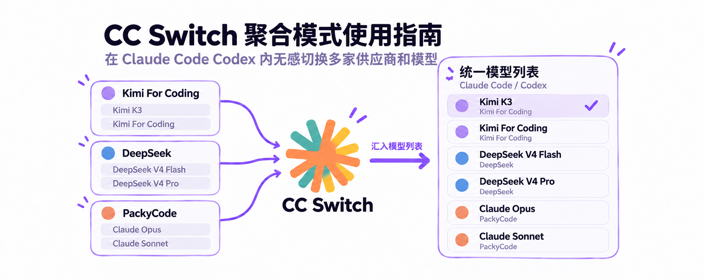
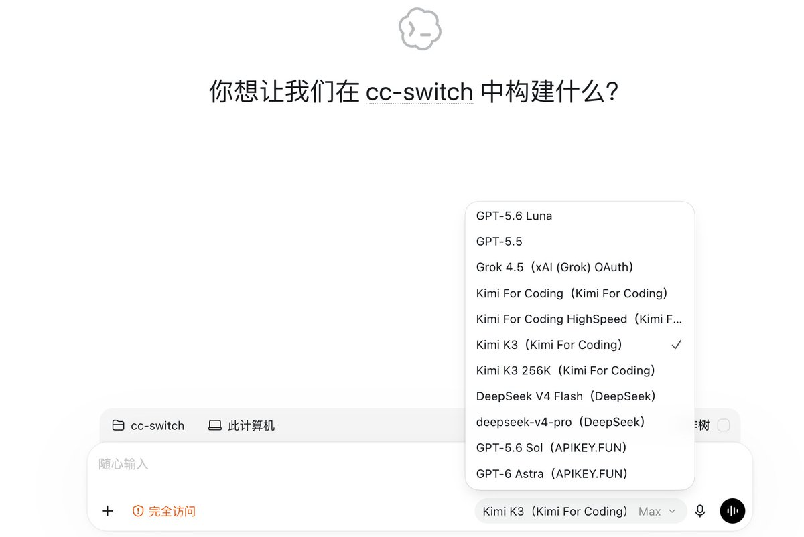
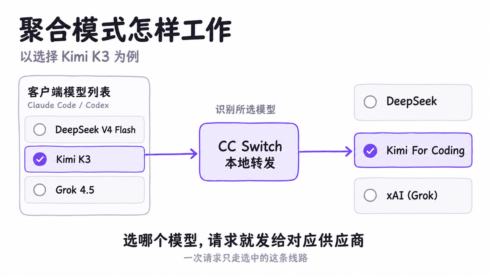
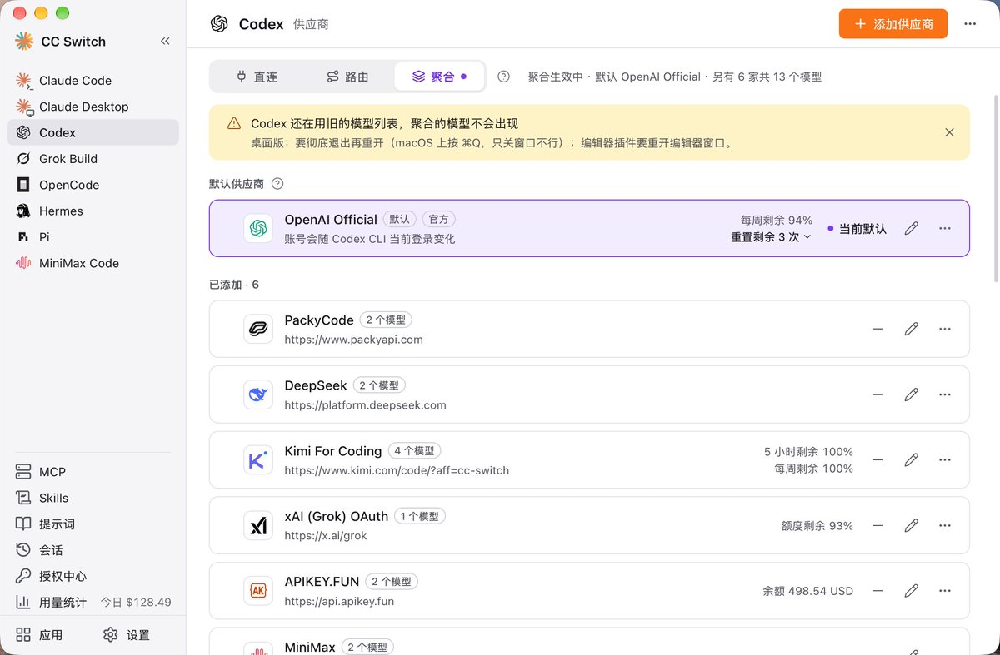
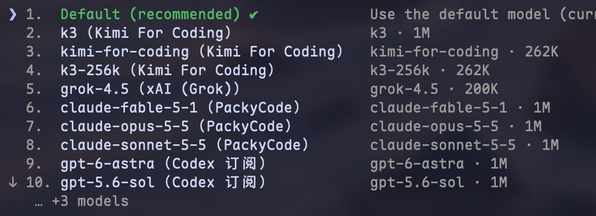

# CC Switch 聚合模式使用指南

用 Claude Code 或 Codex 写代码时，你可能不只使用一家供应商：有自己常用的模型，也有想试试的新模型；有官方订阅，也有另外购买的 API 或编程套餐。

过去，想换一家供应商，通常要先回到 CC Switch 主界面或者托盘切换，再返回客户端继续工作。CC Switch 4.0 新增的**聚合模式**，让这件事可以直接在客户端里完成：把多家供应商的模型放进同一个模型列表，在应用内无感切换，选哪个模型，请求就发给对应的供应商。

目前，聚合模式支持 **Claude Code 和 Codex**。这篇文章就从实际效果开始，带你完成配置，并讲清默认供应商、重启和日常切换的区别。

## 在 Codex 里直接选择多家模型

先看开启聚合后的 Codex 桌面版。

原有的 GPT 模型与来自其他供应商的 Grok、Kimi、DeepSeek 等模型，出现在了同一个列表中。第三方模型名称后面标有供应商，方便辨认具体来源。截图中选中的是 **Kimi K3（Kimi For Coding）**，接下来的请求就会发给配置的 Kimi For Coding 供应商。

模型名称与可选范围取决于你自己的配置，截图展示的是一组使用示例。即便两家供应商提供同名模型，你也可以根据条目中的供应商名称，选择想使用的那一条线路。

你可以在一个会话中先讨论方案，再换一个模型继续实现或检查代码，不必为了更换供应商重新开始一段对话。配置完成之后，日常选模型就在客户端里进行。

## 聚合模式怎样分发请求

聚合模式做了两件事：先把各家的模型整理到客户端的模型列表里，再根据你选中的条目，把请求发给对应供应商。

例如，你选择 Kimi For Coding 提供的模型，CC Switch 就使用这家供应商的连接配置转发请求；换成 DeepSeek 提供的模型，后续请求就交给 DeepSeek。每次请求按所选条目发送，加入多家供应商不会让它们同时回答同一个问题。

有时你会看到带 `ccs-` 前缀的模型 ID。这是 CC Switch 用来识别供应商和模型的标记，直接在模型列表里选择即可，不需要手动编写。

## 在 CC Switch 中完成配置

下面以 Codex 为例。Claude Code 的入口和操作方式相同，但两个应用的聚合名单需要分别配置。

截图顶部显示“聚合生效中”，默认供应商是 OpenAI Official，另外添加了 **6 家供应商、共 13 个模型**。每张卡片旁边也标出了这家供应商配置的模型数量。

### 第一步 进入聚合页面

在 CC Switch 左侧选择 **Codex**，然后点击顶部的「聚合」标签。

**点标签只是切换正在查看的页面，不代表已经开启聚合。** 是否真正生效，要看顶部的模式状态。

### 第二步 准备供应商和模型列表

如果还没有供应商，点击右上角「添加供应商」，按所选预设填写连接信息，例如 API 地址和密钥；需要登录或绑定账号的供应商，则完成对应的账号配置。已有供应商可以直接点击卡片上的编辑按钮。

在「聚合」页添加或编辑时，表单会集中展示连接信息和「模型列表」。最近的版本进一步强化了模型列表获取和模型信息补全，配置多家供应商时，可以省去不少逐个查找、复制和填写的工作。

**一键获取：从供应商拉取模型列表**

填好连接信息或完成账号配置后，点击「获取模型列表」，CC Switch 就会向供应商查询可用模型。新版适配了更多供应商的模型接口地址和返回格式，减少了因为接口差异而获取不到列表的情况。

获取成功后，可以搜索、勾选需要的模型，再点击「添加所选模型」批量加入。这一步决定哪些模型会出现在客户端的选择器里：你可以只留下常用的几个，不必把供应商返回的全部模型都加入聚合。

**自动补全：选好模型后，补上它的能力信息**

勾选需要的模型并加入列表后，**CC Switch 会自动从 models.dev 拉取对应模型的资料，补全上下文窗口、思考等级等信息**。以本文的 Codex 配置为例，还会根据可用资料补充文字、图片输入能力。选好模型后，这些信息会自动填入空缺的配置项，省去逐项查资料、手动填写的工作。

补全会优先参考与当前供应商地址匹配的内置预设，再结合 models.dev 中的供应商和原厂模型资料。**已有的参数会保留，自动补全只填写空缺项**；补全后还会提示信息来源，方便核对。不同供应商部署同一模型时，实际支持的窗口和能力可能不同，因此仍应以当前供应商的支持情况为准。

**手动添加：用于列表缺失或自定义模型**

如果供应商没有开放模型列表接口，或列表里暂时没有你需要的模型，可以点击「手动添加」，填写供应商实际支持的模型 ID，再按需填写显示名称和能力参数。它适合补充自动获取未覆盖的条目，例如供应商提供的自定义模型别名。

这里配置的模型，是之后在客户端里可选的内容。无论自动获取还是手动添加，填写名称和参数都不会改变模型本身的能力。

列表中的 **★ 表示这家供应商的默认模型**。在 Claude Code 中，它位于列表第一项；这家成为默认供应商后，启动默认和后台任务等默认角色会使用它。Codex 则使用配置中指定的默认模型。

### 第三步 把供应商加入聚合名单

在「可添加」区域找到需要的供应商，点击「添加」。添加后，它会进入聚合名单。

添加供应商配置与加入聚合名单是两件事。只是创建了一张供应商卡片，还需要把它加入当前应用的聚合名单。

第一次使用，可以先配好常用的两三家，确认模型能够正常调用，再逐步增加。

### 第四步 选择默认供应商并开启

点击「切换到聚合模式」，在确认框中选择默认供应商，检查将加入的供应商和模型数量，然后确认。

进入聚合时，CC Switch 会自动启动所需的本地路由服务。看到顶部显示“聚合生效中”，就表示模式已经开启。接下来按客户端要求重新加载模型列表，再选择模型开始使用。

## 默认供应商负责什么

**默认供应商承接没有明确指定聚合供应商的普通模型请求。** 你在客户端明确选中了某家聚合模型后，那次请求就会交给对应供应商处理。

如果你在 Codex 中使用官方账号，同时也想调用第三方模型，可以像截图一样，将 **OpenAI Official 设为默认供应商**，再添加其他供应商。官方模型和第三方模型就能在同一个选择器中使用。

Codex 的官方账号只能作为默认供应商，不能作为普通聚合成员加入。

开启聚合后，想更换默认供应商，可以在目标供应商卡片的「更多」菜单里选择「设为默认」。当前默认供应商不能直接移除，需要先把另一家设为默认。

## 官方订阅的支持范围与账号风险

Codex 本身支持自定义模型供应商，官方文档也提供了通过代理使用 OpenAI 认证的配置方式。CC Switch 因此支持将 OpenAI Official 设为默认供应商，让官方模型与第三方模型出现在同一个列表中。不过，支持这种接入方式，不等于可以承诺账号“零风险”，使用时仍需遵守平台规则。[Codex 官方认证说明](https://learn.chatgpt.com/docs/auth#alternative-model-providers)

Claude 官方订阅的情况不同。Anthropic 对第三方工具使用订阅凭据有明确限制，包括禁止第三方开发者代用户通过 Free、Pro 或 Max 订阅凭据转发请求，以及收集、存储或中介处理 Claude.ai 登录凭据。这与用户在原版 Claude Code 中正常登录自己的订阅是不同的情况。[Claude Code 官方规定](https://code.claude.com/docs/en/legal-and-compliance#authentication-and-credential-use)

考虑到许多 CC Switch 用户并不熟悉这些接入方式和规则差异，我们选择采取更保守的支持策略：**聚合模式暂不支持 Claude 官方订阅**。需要使用该订阅时，请回到直连模式，在 Claude Code 中通过官方登录流程使用。这个限制针对官方订阅接入，不代表 Claude Code 的聚合模式不能使用其他已支持的模型供应商。

## 在 Claude Code 中使用聚合模型

在 CC Switch 左侧选择 Claude Code，配置好它自己的供应商和聚合名单，然后开启聚合。在 Claude Code 中输入 `/model`，就能看到模型列表。

截图中的 Kimi、Grok、Claude 和 GPT 系列模型来自不同供应商。括号里显示供应商名称，右侧还展示模型 ID 和配置的上下文窗口。

选择所需条目后，就可以继续当前会话。模型的上下文窗口、图片输入和工具能力仍取决于实际模型及上游支持，不能只靠修改显示名称或窗口配置获得。

Claude Code 需要 **2.1.243 或更新版本**才能显示聚合模型。模型列表修改后可以立即生效，无需重启。CC Switch 改写客户端配置后，如果当前选中的是聚合模型，按提示重新选择一次即可。

## Codex 需要怎样重启

Codex 在启动时读取模型列表。因此，进入或退出聚合模式、添加或移除供应商、修改模型列表后，需要重新加载。CC Switch 页面里的黄色提示，就是在提醒客户端还在使用旧列表。

| 使用方式 | 操作方法 |
| --- | --- |
| Codex 桌面版 | 彻底退出后重新打开。macOS 按 `⌘Q`，只关窗口不够。 |
| Codex CLI | 按 CC Switch 提示重启 Codex 守护进程，再重新打开 Codex。仅重开命令行客户端可能仍使用旧列表。 |
| 编辑器插件 | 重开编辑器窗口。 |

所有终端中的 Codex CLI 共用守护进程，重启会中断相关的运行中任务，操作前先等任务结束。

**重新加载针对的是配置或模型列表发生变化。** 在已经加载好的模型列表里选择另一个模型，不需要每次重启。

## 聚合和路由怎么选

CC Switch 的三种模式，适合不同的使用习惯。

| 模式 | 请求如何发送 | 适合的需求 |
| --- | --- | --- |
| 直连 | 客户端直接连接供应商 | 使用一家供应商，按需在 CC Switch 切换。 |
| 路由 | 经过 CC Switch 本地转发，可配置故障转移 | 需要接口转换，或者故障后自动换供应商。 |
| 聚合 | 经过 CC Switch 本地转发，按所选模型发送给对应供应商 | 希望在客户端里随时选择多家模型。 |

**聚合模式不做故障转移。** 选中的供应商不可用时，需要手动选择其他可用模型。原有故障转移队列和设置会保留，回到路由模式后可以继续使用。

聚合也不会自动比较价格、挑选最快的模型。它把选择放到你手里：用哪一个模型、走哪一家供应商，由你在客户端决定。

## 日常使用的几个细节

**使用期间保持 CC Switch 运行。** 聚合请求需要经过本地服务转发。正常退出 CC Switch 时会自动恢复直连配置，下次启动再接上；之后按页面提示处理客户端刷新。

**切换模型后的第一轮，费用可能更高。** 在同一会话里换模型，新模型可能需要重新建立提示词缓存。历史对话越长，重新处理上下文的成本越值得留意，缓存通常不能在不同供应商之间直接共享。

**模型选中后仍可能受到能力差异影响。** CC Switch 会按配置进行必要的接口转换，但不同模型在图片、推理等级、联网搜索等方面的支持并不完全相同。选择模型时，还要考虑正在进行的任务需要哪些能力。

**移除供应商后，记得重新选模型。** 如果客户端还保留着已移除供应商的旧聚合选项，请求会报错并提示重新选择，不会自动改发给另一家。切回路由模式后，聚合模型会从列表撤下，聚合名单则会保留。

配置好聚合后，你可以让常用模型保持默认，把其他模型留在选择器中，需要时再切换。在熟悉的 Claude Code 或 Codex 会话里，就能完成从选模型到继续工作的整个过程。

## 致敬 opencodex

CC Switch 的聚合模式大量学习和参考了 [opencodex](https://github.com/lidge-jun/opencodex)：通过供应商前缀区分模型，让多家模型同时出现在客户端的选择器里；让 Codex 在使用第三方模型时也能处理上下文压缩；检测后台服务是否仍在使用旧的模型列表，并提醒用户重启。这些设计都受益于 opencodex 的开源探索。

感谢作者 [@lidge-jun](https://github.com/lidge-jun) 和贡献者们把这些成果分享出来，让其他开发者能够学习、借鉴，并继续改进用户体验。向他们的工作和开源精神致敬！

如果你希望在 Codex 或 Claude Code 中接入更多供应商和模型，也非常推荐了解和试用 [opencodex](https://github.com/lidge-jun/opencodex)。

## 相关文档

- [聚合模式用户手册](../user-manual/zh/4-proxy/4.6-aggregation.md)
- [本地路由](../user-manual/zh/4-proxy/4.2-routing.md)
