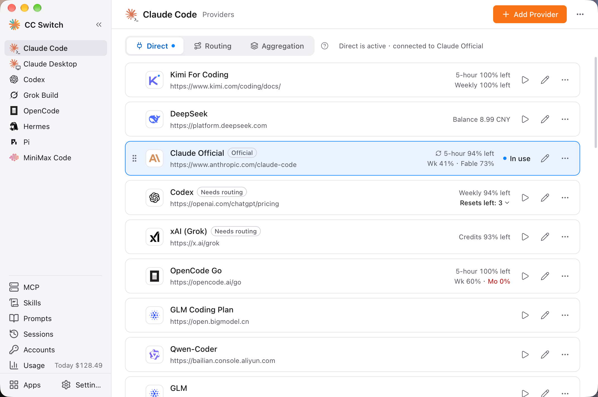

# 1.3 Interface Overview

## Main Interface Layout

The main window is split into a left sidebar and a content area on the right:

- **Left sidebar**: Choose the app to manage, or open a global feature page
- **Content area**: The page header (app name, the "Add Provider" button, and the ⋯ menu) at the top, with the content of the current page below it

## Left Sidebar

The sidebar has three sections from top to bottom:

| Section | Contents |
|---------|----------|
| App list | The managed apps you chose to display (up to 10). Click an app to show its provider page on the right. A small marker next to an app's name shows that it is currently using Routing, Aggregation, or model mapping, and "Needs attention" appears when something is wrong |
| Global pages | MCP, Skills, Prompts, Sessions, Accounts, and Usage ("Today $xx" is shown next to it when there is spending today). These pages don't belong to a single app, and each has one entry |
| Bottom | "Apps" (install, upgrade, and choose which apps show in the sidebar) and "Settings" |

Click the collapse button at the top of the sidebar to shrink it to icons only; click it again to expand. A dot next to "Apps" or "Settings" means a command-line tool or CC Switch itself has a new version.

> Shortcut `Cmd/Ctrl + ,` opens Settings at any time.

### Managed Apps

- **Claude Code** - Manage Claude Code configuration
- **Claude Desktop** - Manage Claude Desktop third-party providers and official mode
- **Codex** - Manage Codex configuration
- **Gemini** - Manage Gemini CLI configuration
- **Grok Build** - Manage Grok Build configuration
- **OpenCode** - Manage OpenCode configuration
- **OpenClaw** - Manage OpenClaw configuration
- **Hermes** - Manage Hermes Agent providers and Memory
- **Pi** - Manage Pi providers and models
- **MiniMax Code** - Manage MiniMax Code custom providers

Apps you rarely use can be hidden on the sidebar's "Apps" page. Once hidden, an app no longer appears in the sidebar, in the MCP / Skills app columns, or in the app pickers on Prompts and Sessions; its existing configuration is not affected.

### Global Pages

| Entry | Purpose |
|-------|---------|
| MCP | Manage MCP servers and enable them per app; see [3.1 MCP](../3-extensions/3.1-mcp.md) |
| Skills | Install and manage skills; see [3.3 Skills](../3-extensions/3.3-skills.md) |
| Prompts | Manage system prompts; see [3.2 Prompts](../3-extensions/3.2-prompts.md) |
| Sessions | Browse and search each tool's session history |
| Accounts | Manage ChatGPT (Codex), GitHub Copilot, xAI, and other OAuth accounts in one place |
| Usage | Request statistics overview, trend charts, request logs, provider/model statistics, and cost pricing |

Not every app supports every feature: Claude Desktop and OpenClaw are not part of MCP or Skills, and the MCP, Skills, Prompts, and Sessions actions on the Claude Desktop page operate on Claude Code's data.

## App Pages

### App Page Header

The header shows the app name and the page name (for example "Claude Code Providers"). On the right are:

- **Add Provider**: Add a new provider
- **Project switcher**: Hidden by default; turn on "Show project switcher" in "Settings → General → Sidebar and header" (not available on the MiniMax Code page)
- **⋯ menu**: View sessions, config directory, install and upgrade, hide from sidebar, and view usage for this app
- The Hermes header also has a "Web UI" button

OpenClaw and Hermes show a row of tabs under the header for switching between the provider page and their own pages:

| App | Tabs |
|-----|------|
| OpenClaw | Providers, Workspace, Config |
| Hermes | Providers, Memory |

### Connection Modes

The provider pages of Claude Code, Codex, Gemini CLI, and Grok Build have three tabs at the top: **Direct / Routing / Aggregation** (Aggregation exists only for Claude Code and Codex; Claude Desktop has Direct / Model mapping instead). The dot on a tab marks the mode currently in effect, and the text next to it says which provider is connected right now.

Clicking a tab only shows the list for that mode and does not change any configuration. To actually switch, click the button below that spells out the consequences: "Start routing", "Switch to Aggregation", or "Back to direct". For Routing see [4.2 App Routing](../4-proxy/4.2-routing.md), and for Aggregation see [4.6 Aggregation Mode](../4-proxy/4.6-aggregation.md).

### Provider Cards

Each provider is displayed as a card, containing the following elements from left to right:

| Element | Description |
|---------|-------------|
| Drag handle | Drag to reorder providers (appears on hover) |
| Provider icon | The brand icon |
| Provider info | Name, notes or endpoint URL (click to open the website); badges such as "Official" or "Needs Routing" may appear next to the name |
| Usage info | Remaining quota or balance; shows several rows for multi-plan providers |
| Status / main action | The card currently in effect shows "In use" ("Routing" in Routing mode); other cards show a play button, which switches provider in Direct mode, means "Route here" in Routing mode, and sets the default or adds the provider in Aggregation mode |
| Edit button | Edit the provider configuration |
| ⋯ More | Duplicate, connectivity check, configure usage query, open terminal (Claude Code only), delete |

The provider currently in use cannot be deleted; switch to another one first. "Connectivity check" only checks whether the address is reachable, without sending real model requests, and is unavailable on official providers and MiniMax Code providers. Providers whose quota is displayed automatically, such as Copilot, Codex OAuth, and xAI OAuth, have no "Configure usage query".

The **"Needs Routing"** badge means the provider can only be used through local routing (for example, its API format needs conversion); if you switch to it directly, the client cannot use it. **Official subscriptions do not go through routing** (Codex's OpenAI Official is the exception), so you cannot switch to them in Routing mode.

OpenCode, OpenClaw, Hermes, Pi, and MiniMax Code are "coexist" apps: the card buttons are "Add / Remove" ("Enable / Remove" for Pi), and there are no Direct / Routing / Aggregation tabs.

### Failover Queue and Health Status

In Routing mode, the provider page is split into "Queue · by priority" and "Not in queue". Providers in the queue take requests in order, and when the previous one fails repeatedly, the next one takes over automatically. You can reorder them with move up, move down, or drag; see [4.3 Failover](../4-proxy/4.3-failover.md) for setup.

Providers in the queue show a health status:

| Status | Description |
|--------|-------------|
| Operational | 0 consecutive failures |
| Degraded | Has failures, but the circuit breaker has not tripped |
| Circuit Open | The circuit breaker has tripped; the provider is temporarily skipped (for thresholds, see [4.3 Failover](../4-proxy/4.3-failover.md#circuit-breaker-configuration)) |

### Apps Page

The "Apps" page at the bottom of the sidebar manages command-line tools:

- See each tool's current and latest version, install missing tools, and upgrade installed ones
- Choose which apps show in the sidebar
- "Manual install commands" lets you copy each tool's install command

Claude Desktop is a desktop app and cannot be installed or upgraded here; the page only shows whether it is connected. Whether to check for new versions at launch is controlled by "Settings → General → New versions of your apps".

## System Tray

CC Switch displays an icon in the system tray, providing quick access to operations.

<!-- TODO(v4 screenshot): Expanded tray menu showing the app submenus (Claude Code / Codex, etc.) -->

### Tray Menu

| Menu Item | Function |
|-----------|----------|
| Open CC Switch | Show and focus the main window, always on top |
| App submenus | One submenu each for the five switch-mode apps: Claude Code, Claude Desktop, Codex, Gemini CLI, and Grok Build. The title shows the current provider and mode; click a provider in the submenu to switch, and the current one has a checkmark. You can also open the app page or add a provider there, and some apps show a quota summary |
| Projects | Switch projects (a full set of provider, MCP, Skills, and prompt states); appears only after "Show project switcher" is turned on |
| Lightweight mode | Checkbox to enter or exit tray-only mode |
| Open official website | Open ccswitch.io in the browser |
| Quit CC Switch | Fully exit the application. When an app is using Routing or Aggregation, the item reads "Quit CC Switch (stops the routing service)" |

Problems such as the routing service not running or a switch failing for an app are shown at the top of the menu, and a small dot also appears on the tray icon.

> **Note**: Coexist apps (OpenCode, OpenClaw, Hermes, Pi, MiniMax Code) do not appear in the tray; use the main window for them. Apps with no configured providers show a corresponding hint in their submenu. Which apps appear in the tray is determined by the display toggles on the "Apps" page.

### Multi-language Support

The tray menu follows the interface language and supports Simplified Chinese, Traditional Chinese, English, and Japanese; if no language has been set yet, it follows the system language.

### Lightweight Mode

The tray menu includes a **Lightweight mode** checkbox. When enabled:

- The main window is closed to free up resources
- The app continues running in the system tray only
- You can still switch providers via the tray submenus
- On macOS, the Dock icon is also hidden

To exit Lightweight mode, uncheck the option or click "Open CC Switch" — the main window will be rebuilt and shown.

### Use Cases

Switching providers via the tray menu doesn't require opening the main window, suitable for:

- Frequently switching providers
- Quick operations when the main window is minimized
- Managing configurations while running in the background
- Running in Lightweight mode for minimal resource usage

## Settings

Click "Settings" at the bottom of the sidebar. The sidebar is replaced by the settings menu, and the current group is shown on the right; click "Back" or press `Esc` to return to the main interface. Settings has 6 groups:

### General

- **Appearance**: Interface language (Simplified Chinese/Traditional Chinese/English/Japanese) and light/dark theme (System/Light/Dark)
- **Sidebar and header**: Which apps show in the sidebar (jumps to the "Apps" page) and the project switcher
- **New versions of your apps**: Check for new versions of your apps at launch
- **Window and terminal**: Launch on startup, close button behavior (hide to tray or quit), and preferred terminal

### App config

- Each app's configuration directory override (except Claude Desktop and MiniMax Code)
- Per-app options, such as Claude Code's "Apply to Claude Code extension" and "Skip Claude Code first-run confirmation", and Codex's keep-official-login option for direct switches

### Local routing

- Service: listen address and port, start/stop
- Apps using routing
- Auto Failover
- Rectifier
- Switch all back to direct

### Network

- Global Outbound Proxy

### Data

- Location (the CC Switch configuration directory)
- Data Management (SQL import/export)
- Backup & Restore (including the "Other Backups" overview)
- Cloud Sync
- Application Diagnostic Logs

### About

- Version information and update check
- GitHub, official website, and release notes

## Keyboard Shortcuts

| Shortcut | Function |
|----------|----------|
| `Cmd/Ctrl + ,` | Open Settings |
| `Cmd/Ctrl + F` | Search providers (on a provider page) |
| `Esc` | Close search; on a settings page, go back to the main interface |

## Search

Press `Cmd/Ctrl + F` on a provider page to open the search bar:

- Search by name, notes, or URL
- Real-time provider list filtering
- Press `Esc` to close search
