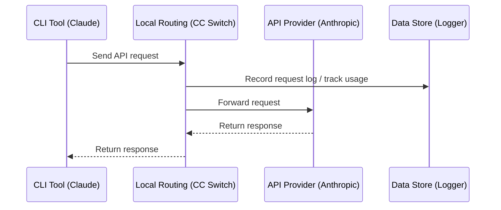

# 4.1 Local Routing Service

## Overview

Local routing starts an HTTP service on your machine. Once an app enters Routing mode, that app's API requests go to CC Switch first, and CC Switch forwards them to the current provider.

**Primary uses**:
- Format conversion: lets Claude Code use providers with OpenAI or Gemini formats, and lets Codex and Grok Build use providers with Chat Completions or Anthropic Messages formats
- Automatic failover: when a request to the current provider fails, switches to a backup provider according to the queue
- Hot switching: a provider switch takes effect immediately for subsequent requests
- Records the usage and status of every request

Apps that support local routing: **Claude Code**, **Codex**, **Gemini CLI**, **Grok Build**. Claude Desktop's "Model Mapping" mode is also forwarded through local routing; see [2.6 Claude Desktop](../2-providers/2.6-claude-desktop.md).

> 💡 You don't need local routing to track usage: with routing off, CC Switch also collects usage from each tool's local session logs. See [4.4 Usage Statistics](./4.4-usage.md).

## Start Local Routing

Local routing normally doesn't need to be started by hand:

- On an app's page (pick an app in the sidebar), switch to the "Routing" tab at the top and click "Start routing". After you confirm, that app is forwarded through local routing, and the service starts automatically if it isn't running. In both Routing and Aggregation modes, requests go through the local routing service first
- When Claude Desktop uses a "Model mapping" provider, the service also starts automatically and keeps running; see [2.6 Claude Desktop](../2-providers/2.6-claude-desktop.md)

Clicking the "Direct / Routing / Aggregation" tabs at the top is only for viewing and doesn't change any configuration. To actually switch, use the button under the tabs that spells out the consequence ("Start routing", "Switch to Aggregation", "Back to direct").

<!-- TODO(v4 screenshot): Top of an app page with the Direct / Routing / Aggregation tabs, "Routing" selected but not active, showing the "Start routing" button -->

You can also click "Start" manually in the "Service" area under "Settings → Local routing". If the service isn't running while an app is in Routing or Aggregation mode, the app page shows "routing service isn't running, so requests will fail" with two buttons: "Start service" and "Back to direct".

<!-- TODO(v4 screenshot): Settings → Local routing page, Service area (running status, statistics, listen address and port, record request usage) -->

## Routing Configuration

### Basic Configuration

In "Settings → Local routing → Service":

| Setting | Description | Default |
|---------|-------------|---------|
| Listen Address | IP address local routing binds to; IPv4, IPv6 and `localhost` are supported | `127.0.0.1` |
| Listen Port | Port local routing listens on (1024–65535) | `15721` |
| Record Request Usage | Writes the usage and status of routed requests to the local statistics database; when off, Usage has no per-request details for routed requests | Enabled |

Retry count and timeouts are configured per app; see [4.3 Failover](./4.3-failover.md).

### Modify Configuration

1. Change the address or port under "Listen address and port"
2. Click "Save and restart service" (only clickable when there are changes)

After saving, the service restarts automatically with the new address and port.

### Listen Address Options

| Address | Description |
|---------|-------------|
| `127.0.0.1` | Only accessible from local machine (recommended) |
| `0.0.0.0` | Allow LAN access |

## Running Status

The top of "Settings → Local routing → Service" shows the service status: "Running · up X h Y min" when running, otherwise "Stopped". While the service is running, these statistics are shown on the right:

| Metric | Description |
|--------|-------------|
| Requests | Total number of requests since startup |
| Success rate | Percentage of successful requests |
| Active connections | Number of requests currently being processed |

### Apps using routing

"Apps using routing" lists every app in Routing or Aggregation mode, with its target, for example:

```
Claude Code · Routing    Routed to PackyCode
Codex · Aggregation      Default AIGoCode
Claude Desktop · Model mapping · kept running    Current provider xxx
```

"Open" on the right of each row opens that app's page. When no app is using routing, this shows "No app is using routing".

### Failover Queue

Queues are managed in the "Routing" tab of each app page, and their parameters are tuned under "Auto failover" in "Settings → Local routing". See [4.3 Failover](./4.3-failover.md).

## How It Works

### Request Flow



### Configuration Changes

Once an app enters Routing mode, CC Switch points that app's request address at local routing:

**Claude**:
```json
{
  "env": {
    "ANTHROPIC_BASE_URL": "http://127.0.0.1:15721"
  }
}
```

**Codex**:
```toml
[model_providers.custom]   # section of the current provider
base_url = "http://127.0.0.1:15721/v1"
```

**Gemini**:
```
GOOGLE_GEMINI_BASE_URL=http://127.0.0.1:15721
```

**Grok Build**: the request address in `~/.grok/config.toml` points to `http://127.0.0.1:15721/grokbuild/v1`.

While routing, the API Key in the config file is replaced with a placeholder; the real Key is kept in CC Switch and injected by local routing when it forwards requests.

## Format Conversion

Local routing automatically converts requests and responses according to the provider's configured "Upstream Format", for both streaming and non-streaming requests.

**Claude Code / Claude Desktop side** (the client sends Anthropic Messages requests):

| Provider Upstream Format | Local Routing Behavior |
|--------------------------|------------------------|
| **Anthropic Messages** | Pass-through (no conversion) |
| **OpenAI Chat Completions** | Converts to OpenAI Chat format and responses back |
| **OpenAI Responses API** | Converts to OpenAI Responses format and responses back |
| **Gemini Native generateContent** | Converts to Gemini native format and responses back |

**Codex / Grok Build side** (the client sends OpenAI Responses requests):

| Provider Upstream Format | Local Routing Behavior |
|--------------------------|------------------------|
| **Responses (native)** | Pass-through (no conversion) |
| **Chat Completions** | Converts to Chat Completions format and responses back |
| **Anthropic Messages** | Converts to Anthropic Messages format and responses back |

The upstream format is configured per provider in the advanced options when adding or editing a provider; see [2.1 Add Provider → Upstream Format (Claude)](../2-providers/2.1-add.md#upstream-format-claude) and [Upstream Format and Model Mapping for Codex / Grok Build](../2-providers/2.1-add.md#upstream-format-and-model-mapping-for-codex--grok-build).

> **Note**: Format conversion requires local routing to be running, with the corresponding app in Routing mode.

## Stop Local Routing

While an app is in Routing or Aggregation mode, the service can't be stopped: the "Stop" button under "Settings → Local routing → Service" is greyed out with the hint "Some apps still use the routing service. Switch them back to direct first."

There are two ways to take apps out of routing:

- Click "Back to direct" on an app page; this takes one app out at a time
- Click "Switch all back to direct" in "Settings → Local routing"; after you confirm, all apps are written back to their direct configuration and then the routing service stops. Routing targets, failover queues and the aggregation list are all kept

When no app is using routing, you can click "Stop" to shut the service down directly.

### After Leaving Routing

When an app leaves routing, CC Switch will:

1. Write the app's config file back to the direct provider (the one in use before it entered routing, labeled "Direct" on its card)
2. Save request logs
3. Close connections

Quitting CC Switch also writes apps back to direct first, but each app's mode stays unchanged and is re-attached on the next launch; if re-attaching fails, the app goes back to direct and you get a notice.

## Request Logs

### Enable Recording

Turn on the "Record Request Usage" toggle in "Settings → Local routing → Service" (on by default).

### Log Contents

Each request record includes:

| Field | Description |
|-------|-------------|
| Time | Request time |
| App | Claude / Codex / Gemini / Grok Build |
| Provider | Provider used |
| Model | Requested model |
| Tokens | Input/output token count |
| Latency | Request duration |
| Status | Success/failure |

### View Logs

View request logs in "Usage" in the sidebar.

## FAQ

### Port Already in Use

Error message: `Address already in use`

Solution:
1. Change the port (anywhere from 1024 to 65535)
2. Or close the program occupying the port

### Local Routing Fails to Start

Check:
- Is the port occupied
- Are there sufficient permissions
- Is the firewall blocking it

### Request Timeout

Possible causes:
- Network issues
- Provider server issues
- Incorrect local routing configuration

Solutions:
- Check network connection
- Try accessing the provider API directly
- Check provider configuration
