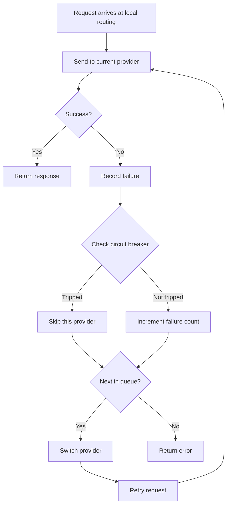
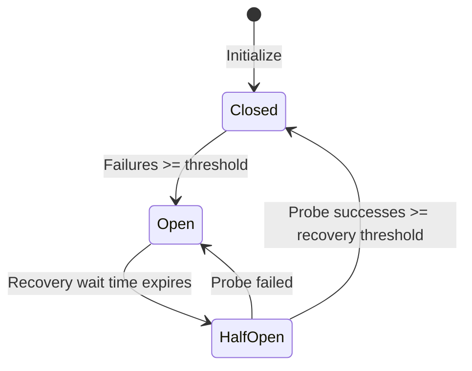

# 4.3 Failover

## Overview

The failover feature automatically switches to a backup provider when the primary provider's request fails, ensuring uninterrupted service.

**Applicable scenarios**:
- Unstable provider services
- High availability requirements
- Long-running tasks

## Prerequisites

Using the failover feature requires:

1. ✅ The app is in Routing mode (the "Routing" tab on the app page, click "Start routing")
2. ✅ The failover switch is on in the "Routing" tab
3. ✅ There are providers in the queue

Failover only supports Claude Code, Codex, Gemini CLI and Grok Build; Aggregation mode doesn't do failover (the queue and settings are kept and take effect again once you return to Routing mode); additive apps (OpenCode, OpenClaw, Hermes, Pi, MiniMax Code) have no failover queue. Official accounts don't join the queue: they use the client's own login and can't rotate with other providers.

## Enable Failover

### Steps

1. On the app page, switch to the "Routing" tab and confirm the app is in Routing mode
2. Turn on the switch with the "Failover" hint at the right of the tab bar (its icon is two crossing arrows)
3. The first time, a confirmation dialog appears; click "I understand, enable"

<!-- TODO(v4 screenshot): The failover switch and the "Routing settings" button at the right of the tab bar in an app page's "Routing" tab -->

The switch only appears when the app is in Routing mode and you're viewing the "Routing" tab.

### Switch Description

| State | Behavior |
|-------|----------|
| Off | Routes only to the selected provider, no automatic switching |
| On | Immediately switches to queue P1, and automatically switches to the next provider in the queue when a request fails; the status line shows "by queue" |

## Manage the Failover Queue

Once failover is on, the providers in the "Routing" tab are split into two groups:

- **Queue · by priority**: requests go to the first one (P1) first; when it fails repeatedly, routing moves on to the next
- **Not in queue**: providers that haven't been added to the queue yet

### Add Backup Providers

Under "Not in queue", click "Add to queue" on the provider card.

### Adjust Priority

Use the move up / move down buttons on the card, or drag the card to reorder. Lower numbers mean higher priority, and the queue order follows the order of the provider list on the home page.

### Remove Provider

Click "Remove from queue" on the provider card in the queue.

## Adjust Retry, Timeout and Circuit Breaker Parameters

Parameters are set per app, with two entry points:

- The "Routing settings" button at the right of the tab bar in the app page's "Routing" tab: opens a side panel for the current app's parameters; "More routing settings" at the bottom of the panel jumps to the settings page
- "Settings → Local routing → Auto failover": choose the app at the top, then adjust that app's parameters

The panel has two parts, "Retry & Timeout Settings" and "Circuit Breaker Settings"; their meanings are covered in the sections below.

## Failover Flow

## Circuit Breaker Configuration

The circuit breaker prevents frequent retries against failing providers.

### Configuration Items

Different apps have independent default configurations. Below are general defaults; Claude has its own relaxed configuration.

| Setting | Description | General Default | Claude Default | Range |
|---------|-------------|-----------------|----------------|-------|
| Failure Threshold | Consecutive failures to trigger circuit breaker | 4 | 8 | 1-20 |
| Recovery Success Threshold | Successes needed in half-open state to close breaker | 2 | 3 | 1-10 |
| Recovery Wait Time | Time before attempting recovery after tripping (seconds) | 60 | 90 | 0-300 |
| Error Rate Threshold | Error rate that opens the circuit breaker | 60% | 70% | 0-100% |
| Minimum Requests | Minimum requests before calculating error rate | 10 | 15 | 5-100 |

> 💡 Claude has more relaxed default settings due to longer request times, tolerating more failures.

### Timeout Configuration

| Setting | Description | General Default | Claude Default | Range |
|---------|-------------|-----------------|----------------|-------|
| Streaming First Byte Timeout | Max wait time for first data chunk (seconds) | 60 | 90 | 1-120 |
| Streaming Idle Timeout | Max interval between data chunks (seconds) | 120 | 180 | 60-600 (0 to disable) |
| Non-Streaming Timeout | Total timeout for non-streaming requests (seconds) | 600 | 600 | 60-1200 |

### Retry Configuration

| Setting | Description | General Default | Claude Default | Range |
|---------|-------------|-----------------|----------------|-------|
| Max Retries | Number of retries on request failure | 3 | 6 | 0-10 |

> 💡 Gemini's default max retries is 5.

### Circuit Breaker States

| State | Description |
|-------|-------------|
| Closed | Normal state, requests allowed |
| Open | Circuit broken, this provider is skipped |
| Half-Open | Attempting recovery, sending probe requests |

### State Transitions

## Health Status Indicators

### Provider Cards

In routing mode, provider cards display health status badges:

| Badge | Status | Description |
|-------|--------|-------------|
| 🟢 | Operational | 0 consecutive failures |
| 🟡 | Degraded | Has failures but circuit not tripped |
| 🔴 | Circuit Open | Circuit breaker tripped, temporarily skipped |

### Queue

Provider cards in the failover queue also display health status; the "Routing" marker shows the provider actually in use (it changes after a successful failover and isn't necessarily the head of the queue).

## Failover Logs

Each failover event records:

| Information | Description |
|-------------|-------------|
| Time | When it occurred |
| Original Provider | The provider that failed |
| New Provider | The provider switched to |
| Failure Reason | Error message |

Viewable in the request logs within usage statistics.

## Best Practices

### Queue Configuration Recommendations

1. **Primary provider**: The most stable and fastest provider
2. **First backup**: Second-best choice
3. **Second backup**: Last resort

### Circuit Breaker Configuration Recommendations

| Scenario | Failure Threshold | Recovery Wait |
|----------|-------------------|---------------|
| High availability requirement | 2 | 30 seconds |
| General scenario | 3 | 60 seconds |
| Tolerant of occasional failures | 5 | 120 seconds |

### Monitoring Recommendations

Periodically check:
- Health status of each provider
- Failover frequency
- Circuit breaker trigger frequency

## FAQ

### Failover Not Triggering

Check:
1. Is local routing running (Settings → Local routing)
2. Is the app in Routing mode (Aggregation mode doesn't do failover)
3. Is the failover switch in the "Routing" tab on
4. Are there backup providers in the queue

### Failover Triggering Too Frequently

Possible causes:
- Unstable primary provider
- Network issues
- Configuration errors

Solutions:
- Check primary provider status
- Adjust circuit breaker parameters
- Consider changing the primary provider

### All Providers Circuit-Broken

Wait for the recovery wait time to expire for automatic recovery, or:
1. In "Settings → Local routing", switch the app back to direct, stop the service, then start routing again
2. Or adjust the circuit breaker parameters
