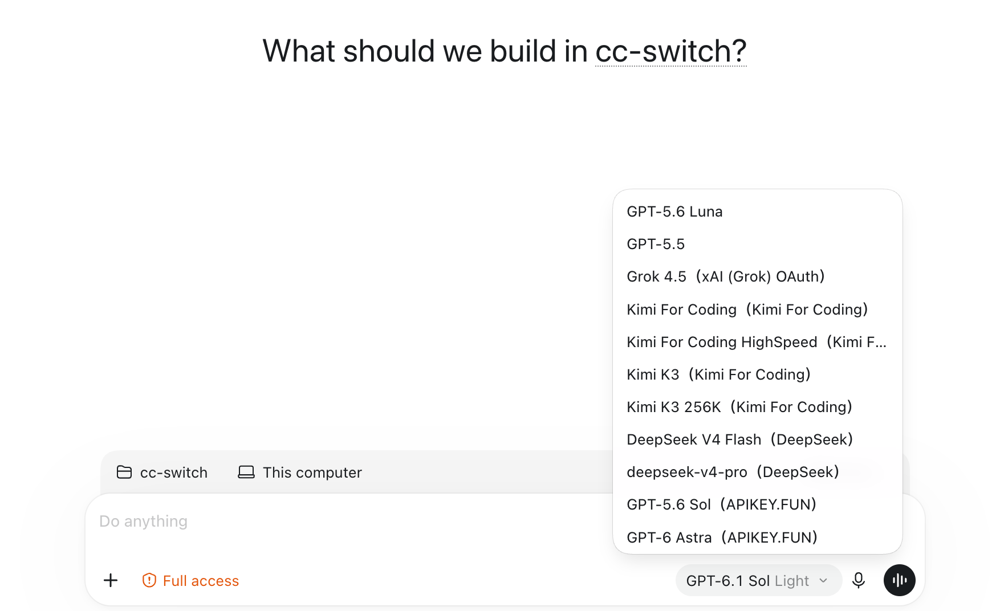

# 4.6 Aggregation Mode

## Overview

Aggregation mode puts the models of several providers into one model list in Claude Code or Codex. Whichever model you pick in the client's `/model`, the request goes to that provider; you don't have to go back to CC Switch to switch providers.

Aggregation mode only supports **Claude Code** and **Codex**. Configure providers and the aggregation list separately for each app.

## How It Differs from Routing

| | Routing | Aggregation |
|------|------|------|
| Providers used at the same time | One (or rotating through the failover queue) | Several, dispatched by the selected model |
| Failover | Supported | Not supported |
| How you switch providers | Switch in CC Switch | Pick a model in the client's `/model` |
| Supported apps | Claude Code / Codex / Gemini CLI / Grok Build | Claude Code / Codex only |

Both go through the routing service on your machine, so both need CC Switch to keep running. An app can only be in one of three modes at a time: Direct, Routing or Aggregation.

## Enter Aggregation Mode

### Location

Select Claude Code or Codex in the sidebar → the "Aggregation" tab at the top of the page

### Steps

1. Click the "Aggregation" tab. Clicking the tab is only for viewing and doesn't change any configuration
2. Configure each provider's model list, add the providers you need to the aggregation list, and confirm the default provider (see below)
3. Click "Switch to Aggregation"
4. In the confirmation dialog, review the default provider and the models that will appear in `/model`, then click "Switch to Aggregation" to confirm

After switching, the page shows "Aggregation is active · default", along with the default provider and how many models the other providers add. To go back to direct, click "Back to direct"; to use routing instead, click "Start routing" in the "Routing" tab.

## Add and Remove Providers

### Add

Under the "Aggregation" tab, the "Available" list holds the providers that haven't been added yet. Click "Add" on a card, and that provider's models appear in the client's model list.

### Remove

In the "Added" list, click "Remove" on the card. Added providers are written into the client's configuration as well.

> ⚠️ The default provider can't be removed; set another provider as the default first.

### Set Each Provider's Models

When editing a provider, use the "Models" list. Configuring models and adding a provider to Aggregation are separate steps: after saving the provider, click "Add" in the "Available" list.

#### Fetch the Model List

Enter the API URL and key, or finish the provider's account setup, then click "Fetch Models". CC Switch queries the provider and handles supported endpoint paths and response formats. Search the results, select the models you need, and click "Add selected" to add them in bulk. You don't need to add every returned model.

#### Fill Model Information Automatically

For Codex, selecting models and adding them to the list automatically fetches matching information from models.dev to fill in the context window, reasoning levels, and text/image input capabilities. Built-in presets matching the provider's endpoint take priority; provider-specific or original-vendor information from models.dev fills the remaining gaps.

Only empty fields are filled; existing parameters are preserved. CC Switch also shows the information source for review. Providers may deploy the same model with different capabilities, so check what your provider actually supports. Unmatched information can be entered manually.

#### Add Models Manually

Use "Add manually" if the provider has no model-list endpoint, a new model is missing from its list, or you need a custom model alias. Enter a model ID the provider actually supports, then set its display name and capability parameters as needed. Changing a name or context-window setting does not change the model's actual capabilities.

#### Default Model

- Configured models appear in the client's model picker; choosing one sends requests to its provider
- ★ marks the provider's default model. In Claude Code, it is the first entry and serves startup and background tasks when that provider is the default; Codex uses the default model specified in its configuration
- A Claude Code provider with neither a model list nor model mappings adds no selectable models; Codex can also use its configured default model
- See "When a Restart Is Needed" below after changing the model list

## Default Provider

The default provider takes all requests without a prefix. Click "Set as default" on a provider card to change it.

For a Codex official account, set **OpenAI Official as the default provider**, then add other providers. OpenAI Official can only be the default provider, not a regular aggregation member.

**Aggregation currently does not support Claude official subscriptions.** To use one, return to Direct mode and sign in through Claude Code's official login flow. This restriction concerns official subscriptions; Claude Code can still aggregate other supported model providers.

Supporting an official account does not guarantee zero account risk; platform rules still apply. See the official documentation on [Codex authentication](https://learn.chatgpt.com/docs/auth#alternative-model-providers) and [Claude Code authentication and credential use](https://code.claude.com/docs/en/legal-and-compliance#authentication-and-credential-use).

## The `ccs-` Prefix in `/model`

Other than the default provider, the models of the other added providers appear in `/model` with a `ccs-` prefix. Picking a model with the `ccs-` prefix sends the request to the corresponding provider; picking one without the prefix sends it to the default provider.

> After you change models within a session, the new model has to build its prompt cache again, so the first turn costs more. Claude Code needs version 2.1.243 or newer.

## When a Restart Is Needed

| App | After the aggregated model list changes |
|-----|------------------|
| Claude Code | Takes effect immediately |
| Codex | Needs a full restart |

Codex only reads its model list at startup. After entering or leaving Aggregation, adding or removing a provider, or changing a provider's models, the page shows "Codex is still using an old model list, so aggregated models won't show"; handle it according to your client:

- **CLI**: reopening codex isn't enough; click "Restart Codex daemon" in the notice. All codex sessions in your terminals share this daemon, and running tasks will be interrupted
- **Desktop app**: quit completely and reopen. On macOS press ⌘Q; just closing the window isn't enough
- **Editor extension**: reopen the editor window

Choosing another model from an already loaded list does not require a restart each time. In Claude Code, after CC Switch rewrites the client config, reselect the aggregated model if prompted.

## Limits

- **No failover**: the queue and settings are kept in Aggregation mode and take effect again once you return to Routing mode
- **Codex's OpenAI Official can only be the default provider**, not a regular aggregation member
- **Claude official subscriptions are currently unsupported** in Aggregation; use Direct mode for them
- **The default provider can't be removed**
- **CC Switch must keep running**: quitting CC Switch automatically returns to direct, and it reconnects on the next start
- When you return to Routing mode, the aggregated models are withdrawn from `/model` (the list is kept), and an aggregated model that is currently selected needs to be changed back to a regular one

## Acknowledgements

Much of Aggregation mode's design draws on [opencodex](https://github.com/lidge-jun/opencodex); thanks to the author and contributors.
