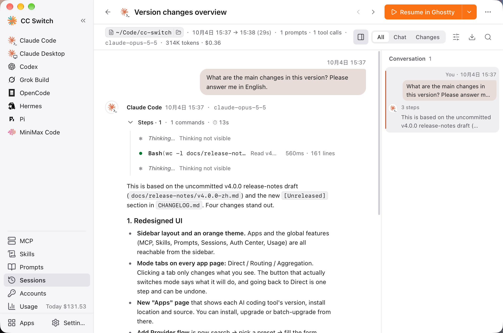

# 3.4 セッションマネージャー

セッションマネージャーでは、対応するすべての CLI ツールの会話セッションを一か所で閲覧、検索、管理できます。

## 対応アプリ

| アプリ | セッション保存場所 |
|------|----------|
| Claude Code | `~/.claude/projects/<プロジェクトディレクトリ>/*.jsonl` |
| Codex | `~/.codex/sessions/` と `~/.codex/archived_sessions/` |
| Gemini CLI | `~/.gemini/tmp/<project>/chats/` |
| Grok Build | `~/.grok/sessions/` と `~/.grok/archived_sessions/` |
| OpenCode | `~/.local/share/opencode/`（JSON または SQLite） |
| OpenClaw | `~/.openclaw/agents/<agent>/sessions/*.jsonl` |
| Hermes | `~/.hermes/state.db` または `~/.hermes/sessions/*.jsonl` |
| Pi | `~/.pi/agent/sessions/` |
| MiniMax Code | `~/.minimax/v2/sqlite/runtime-state.sqlite` |

設定で設定ディレクトリを上書きしている場合、セッションディレクトリもそれに合わせて変わります（OpenCode のセッションは XDG データディレクトリ `~/.local/share/opencode` にあり、設定ディレクトリの上書きの影響を受けません）。MiniMax Code のデータディレクトリは環境変数 `MINIMAX_DATA_DIR` で指定でき、Pi はさらに `PI_CODING_AGENT_DIR` も認識します。

## セッションマネージャーを開く

左サイドバーの **セッション** をクリックします。これはグローバルなページで、開くとデフォルトで現在のアプリのセッションが表示されます。ページ左上のアプリドロップダウンで他のアプリや「すべてのアプリ」に切り替えられます（各項目の後ろにそのアプリのセッション数が表示されます）。

> **注意**：Claude Desktop には独自のセッション記録がなく、そのページから開いた場合に表示されるのは Claude Code のセッションです。Hermes のセッションもドロップダウンで選択します。ページには「Hermes は最新 500 件のセッションのみ表示します」と表示されます。

## インターフェースのレイアウト

セッションマネージャーは 2 つの階層に分かれています：

- **セッション一覧**：上部にアプリドロップダウン、検索ボックス、「時間順 / プロジェクト別」のグループ切り替えがあり、その下にセッション一覧があります
- **セッション詳細**：任意の行をクリックして開くと、ページ全体にそのセッションの会話内容が表示されます。「セッション一覧に戻る」で一覧に戻れます。「前へ / 次へ」でセッション間を移動することもできます

ヘッダー右側の ⋯ メニューには、一覧を更新、複数選択、優先ターミナル（設定へ移動）、セッションの保存場所（各アプリのセッションの保存場所を一覧表示）があります。

### セッション一覧

各セッションエントリには以下が表示されます：
- アプリアイコン
- セッションタイトル
- 最終アクティブ時間と作成時間
- 最後のメッセージの要約
- 右側の「再開」「再開コマンドをコピー」ボタンと ⋯ メニュー

### セッション詳細

セッションを開くと、以下が表示されます：
- **タイトルとプロジェクトディレクトリ**：ディレクトリをクリックするとフルパスをコピー
- **再開**ボタンとその他の再開方法（「ディレクトリに移動して再開」コマンドのコピーなど）
- **会話内容**：質問と返信のターンごとに表示。AI の実行過程（コマンド、ファイルの読み書き、変更）は、展開できる 1 つの「実行過程」にまとめられます
- **ビュー切り替え**：すべて / 会話 / 変更。会話だけ、またはファイルの変更だけを表示できます
- **会話の目次**：特定の質問にすばやく移動
- **検索**：現在のセッション内を検索
- **コピー / エクスポート**：全体を Markdown としてコピー、または Markdown ファイルにエクスポート

## 検索とフィルタリング

### 全文検索

ページ上部の検索ボックスを使用して、以下の項目を検索できます：
- タイトル
- プロジェクトディレクトリ
- 最初と最後のメッセージ
- セッション ID

検索ボックスではタイトル、ディレクトリ、最初と最後のメッセージ、セッション ID を検索でき、リアルタイムで結果をフィルタリングします。**Esc** で検索をクリアできます。

### アプリ別フィルター

左上のアプリドロップダウンをクリックして選択します：
- **すべてのアプリ** — すべてのアプリのセッションを表示（Hermes を含む）
- Claude Code、Codex、OpenCode、Hermes、Gemini CLI、Pi、Grok Build、OpenClaw、MiniMax Code

セッション一覧は、右側のセグメントコントロールで「時間順」（今日 / 昨日 / 今週 / それ以前）と「プロジェクト別」の 2 つのグループ表示を切り替えられます。

フィルターは検索と組み合わせて使用できます。

### 更新

ヘッダーの ⋯ メニューの「一覧を更新」をクリックすると、各アプリのディレクトリを再スキャンして、追加または削除されたセッションを検出します。

## セッション操作

### セッションの再開

セッション行（またはセッション詳細）の **再開** ボタンをクリックして、会話を続行します。

**macOS の場合：**
- CC Switch は設定済みのターミナルで再開コマンドを起動します
- ターミナルはセッションのプロジェクトディレクトリで開きます
- ターミナルの起動に失敗した場合、コマンドがクリップボードにコピーされます
- 優先ターミナルはヘッダー ⋯ メニューの「優先ターミナル」で変更できます

**対応ターミナル（macOS）：** Terminal.app、iTerm2、Ghostty、Otty、Kitty、WezTerm、Kaku、Alacritty、Warp

**その他のプラットフォーム：**
- 再開コマンドがクリップボードにコピーされます
- ターミナルに貼り付けてセッションを再開してください

> 再開コマンドが利用できないセッションでは、再開ボタンは無効になります。OpenClaw のセッションはゲートウェイが管理し、Hermes のセッションはまだコマンドラインからの再開に対応していないため、どちらもここからは再開できません。Codex はプロバイダーごとに履歴を分けて保存するため、プロバイダーを切り替えたあと、古いセッションは続行できないことがあります。

再開時、ターミナルはセッションの元のプロジェクトディレクトリで開きます。別のディレクトリで特定の Claude プロバイダーを使ってターミナルを開きたい場合は、Claude プロバイダーカードの「ターミナルを開く」ボタンを使用してください。このボタンでは、まず作業ディレクトリを選択します。

### セッションの削除

セッション行の ⋯ メニューの「削除」をクリックすると、セッションファイルが完全に削除されます。ディスクから直接削除され、ゴミ箱には入らず、元に戻せません。削除前に、具体的に何が削除されるかを説明する確認ダイアログが表示されます。

> ローカルソースパスのないセッションは削除できません。MiniMax Code のセッションは MiniMax Code で削除してください。

### 一括操作

複数のセッションを一度に管理するには：

1. ヘッダーの ⋯ メニューの **複数選択** をクリック
2. 表示されるチェックボックスでセッションを選択
3. **一致したものをすべて選択** でフィルタリング結果をすべて選択、**クリア** で選択解除、**選択を終了** で一括モードを終了
4. 「N 件のセッションを削除」をクリックして選択したすべてのセッションを削除

削除前に件数を表示する確認ダイアログが表示されます。結果には成功した削除件数と失敗件数が報告されます。

## 会話履歴

### メッセージの表示

会話は「質問 - 返信」のターンごとに表示されます：
- あなたの質問と AI の最終的な返信は通常どおり表示されます
- AI の実行過程（コマンドの実行、ファイルの読み取りや変更、MCP の呼び出し、サブエージェントなど）は「実行過程 · N ステップ」の 1 つにまとめられ、展開して各ステップのパラメーター、出力、ファイルの変更を確認できます。失敗したステップには印が付きます
- 思考内容は別に表示されます（一部のツールの思考内容は表示できません）
- 長い内容は既定で折りたたまれ、「全文を表示」で展開できます。2 MB を超える内容は、ソースファイルのパスをコピーしてローカルで確認してください

### 目次

「会話の目次」には、このセッションの各質問（ステップ数、失敗や中断の有無を含む）が一覧表示され、任意の項目をクリックすると該当位置に移動します。

## ヒント

- セッションは最終アクティブ時間の新しい順にソートされます
- アプリドロップダウンのセッション数は検索に応じて更新されます
- OpenCode のセッションは JSON ファイルと SQLite データベースの両方から取得される場合があります（重複は自動的に除去されます）
