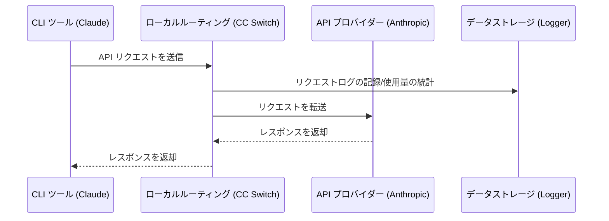

# 4.1 ローカルルーティングサービス

## 機能説明

ローカルルーティングは、ローカルマシン上で HTTP サービスを起動します。あるアプリでルーティングを有効にすると、そのアプリの API リクエストはまず CC Switch に送られ、CC Switch が現在のプロバイダーへ転送します。

**主な用途**：
- インターフェースフォーマットの変換：Claude Code で OpenAI や Gemini フォーマットのプロバイダーを、Codex や Grok Build で Chat Completions や Anthropic Messages フォーマットのプロバイダーを使えるようにする
- 自動フェイルオーバー：現在のプロバイダーへのリクエストが失敗すると、キューに従ってバックアッププロバイダーに切り替える
- ホットスイッチ：プロバイダーを切り替えると、以降のリクエストに即座に反映される
- 各リクエストの使用量と状態を記録

ローカルルーティングに対応するアプリ：**Claude Code**、**Codex**、**Gemini CLI**、**Grok Build**。Claude Desktop の「モデルマッピング」モードもローカルルーティング経由で転送されます。詳しくは [2.6 Claude Desktop](../2-providers/2.6-claude-desktop.md) を参照してください。

> 💡 使用量の統計にローカルルーティングは必須ではありません。ルーティングを有効にしていない場合も、CC Switch は各ツールのローカルのセッションログから使用量を集計します。詳しくは [4.4 使用量統計](./4.4-usage.md) を参照してください。

## ローカルルーティングの起動

ローカルルーティングサービスは、通常は手動で起動する必要がありません。

- アプリページ（サイドバーでアプリを選択）の上部で「ルーティング」タブに切り替えて「ルーティングを開始」をクリックし、確認すると、そのアプリはローカルルーティング経由で転送されるようになります。サービスが動いていなければ自動的に起動します。ルーティング・集約のどちらのモードでも、リクエストはまずこのマシンのルーティングサービスを経由します
- Claude Desktop がモデルマッピングを使うプロバイダーを使用しているときも、サービスは自動的に起動して動き続けます。詳しくは [2.6 Claude Desktop](../2-providers/2.6-claude-desktop.md) を参照してください

上部の「直接接続 / ルーティング / 集約」タブをクリックしても表示が切り替わるだけで、設定は変わりません。実際に切り替えるには、タブの下に結果が書かれているボタン（「ルーティングを開始」「集約に切り替え」「直接接続に戻す」）を押します。

<!-- TODO(v4 screenshot): App page header with the Direct / Routing / Aggregation tabs, Routing selected but not active, showing the "Start routing" button -->

「設定 → ローカルルーティング」の「サービス」エリアで「起動」を押して手動で起動することもできます。サービスが停止している状態でいずれかのアプリがルーティングまたは集約モードになっていると、アプリページに「ルーティングサービスが動いていないためリクエストは失敗します」と表示され、「サービスを起動」と「直接接続に戻す」の 2 つのボタンが現れます。

<!-- TODO(v4 screenshot): Settings → Local routing page, service area (running status, stats, listen address and port, log request usage) -->

## ルーティング設定

### 基本設定

「設定 → ローカルルーティング → サービス」で設定します：

| 設定項目 | 説明 | デフォルト値 |
|--------|------|--------|
| リッスンアドレス | ローカルルーティングがバインドする IP アドレス。IPv4、IPv6、`localhost` に対応 | `127.0.0.1` |
| リッスンポート | ローカルルーティングがリッスンするポート（1024–65535） | `15721` |
| リクエストの使用量を記録 | ルーティングしたリクエストの使用量と状態をローカルの統計データベースに書き込む。オフにすると、使用量統計にルーティング経由のリクエストの明細が残らない | オン |

リトライ回数とタイムアウトはアプリごとに設定します。[4.3 フェイルオーバー](./4.3-failover.md) を参照してください。

### 設定の変更

1. 「待ち受けアドレスとポート」でアドレスまたはポートを変更
2. 「保存してサービスを再起動」をクリック（変更があるときのみ押せます）

保存すると、サービスが自動的に再起動し、新しいアドレスとポートが使われます。

### リッスンアドレスの説明

| アドレス | 説明 |
|------|------|
| `127.0.0.1` | ローカルマシンのみアクセス可能（推奨） |
| `0.0.0.0` | LAN からのアクセスを許可 |

## 実行状態

「設定 → ローカルルーティング → サービス」の上部にサービスの状態が表示されます。実行中は「実行中 · 稼働 X 時間 Y 分」、そうでなければ「停止中」と表示されます。サービスの実行中は、右側に次の統計も表示されます：

| 指標 | 説明 |
|------|------|
| リクエスト数 | 起動以来の総リクエスト数 |
| 成功率 | リクエスト成功の割合 |
| アクティブ接続 | 現在処理中のリクエスト数 |

### ルーティングを使用中のアプリ

「ルーティングを使用中のアプリ」には、ルーティングまたは集約モードになっているすべてのアプリと、それぞれの転送先が表示されます。例：

```
Claude Code · ルーティング    転送先 PackyCode
Codex · 集約          既定 AIGoCode
Claude Desktop · モデルマッピング · 自動で稼働を維持    現在のプロバイダー xxx
```

各行右側の「開く」でそのアプリのページが開きます。ルーティングを使っているアプリがないときは、「ルーティングを使っているアプリはありません」と表示されます。

### フェイルオーバーキュー

キューは各アプリページの「ルーティング」タブで管理し、パラメータは「設定 → ローカルルーティング」の「自動フェイルオーバー」で調整します。詳しくは [4.3 フェイルオーバー](./4.3-failover.md) を参照してください。

## 動作原理

### リクエストフロー



### 設定の変更

アプリがルーティングモードに入ると、CC Switch はそのアプリのリクエスト先アドレスをローカルルーティングに書き換えます：

**Claude**：
```json
{
  "env": {
    "ANTHROPIC_BASE_URL": "http://127.0.0.1:15721"
  }
}
```

**Codex**：
```toml
[model_providers.custom]   # 現在のプロバイダーのセクション
base_url = "http://127.0.0.1:15721/v1"
```

**Gemini**：
```
GOOGLE_GEMINI_BASE_URL=http://127.0.0.1:15721
```

**Grok Build**：`~/.grok/config.toml` のリクエスト先アドレスが `http://127.0.0.1:15721/grokbuild/v1` を指すようになります。

ルーティング中は、設定ファイル内の API Key はプレースホルダーに置き換えられます。実際の Key は CC Switch に保存され、ローカルルーティングが転送時に付与します。

## インターフェースフォーマット変換

ローカルルーティングは、プロバイダーに設定された「上流フォーマット」に従ってリクエストとレスポンスを自動的に変換します。ストリーミングと非ストリーミングの両方のリクエストに対応しています。

**Claude Code / Claude Desktop 側**（クライアントは Anthropic Messages リクエストを送信）：

| プロバイダーの上流フォーマット | ローカルルーティングの動作 |
|------|------|
| **Anthropic Messages** | パススルー（変換なし） |
| **OpenAI Chat Completions** | OpenAI Chat フォーマットに変換し、レスポンスを逆変換 |
| **OpenAI Responses API** | OpenAI Responses フォーマットに変換し、レスポンスを逆変換 |
| **Gemini Native generateContent** | Gemini ネイティブフォーマットに変換し、レスポンスを逆変換 |

**Codex / Grok Build 側**（クライアントは OpenAI Responses リクエストを送信）：

| プロバイダーの上流フォーマット | ローカルルーティングの動作 |
|------|------|
| **Responses（ネイティブ）** | パススルー（変換なし） |
| **Chat Completions** | Chat Completions フォーマットに変換し、レスポンスを逆変換 |
| **Anthropic Messages** | Anthropic Messages フォーマットに変換し、レスポンスを逆変換 |

上流フォーマットは、プロバイダーの追加・編集時に高度なオプションでプロバイダーごとに設定します。詳しくは [2.1 プロバイダーの追加 → 上流フォーマット（Claude）](../2-providers/2.1-add.md#上流フォーマットclaude) と [Codex / Grok Build の上流フォーマットとモデルマッピング](../2-providers/2.1-add.md#codex--grok-build-の上流フォーマットとモデルマッピング) を参照してください。

> **注意**：フォーマット変換には、ローカルルーティングが実行中で、かつ対象アプリがルーティングモードになっている必要があります。

## ローカルルーティングの停止

アプリがルーティングまたは集約モードの間は、サービスを停止できません。「設定 → ローカルルーティング → サービス」の「停止」ボタンはグレーになり、「ルーティングサービスを使っているアプリがあります。先に直接接続へ戻してください」と表示されます。

アプリをルーティングから抜けさせる方法は 2 つあります：

- アプリページで「直接接続に戻す」をクリックする（一度に 1 つのアプリだけ抜けます）
- 「設定 → ローカルルーティング」で「すべて直接接続に戻す」をクリックし、確認すると、すべてのアプリに直接接続の設定が書き戻され、その後ルーティングサービスが停止します。転送先、フェイルオーバーキュー、集約のリストは保持されます

ルーティングを使っているアプリがなければ、「停止」をクリックしてそのままサービスを止められます。

### 終了後の処理

アプリがルーティングから抜けるとき、CC Switch は以下を実行します：

1. アプリの設定ファイルを直接接続のプロバイダー（ルーティングに入る前に使っていた、カードに「直接接続」と表示されているもの）に書き戻す
2. リクエストログを保存
3. 接続を閉じる

CC Switch を終了するときも、先に直接接続へ書き戻します。アプリのモードは変わらず、次回の起動時に再び接続されます。接続できなかった場合は、アプリは直接接続に戻り、通知が表示されます。

## リクエストログ

### 記録の有効化

「設定 → ローカルルーティング → サービス」で「リクエストの使用量を記録」スイッチをオンにします（デフォルトはオン）。

### ログの内容

各リクエスト記録には以下が含まれます：

| フィールド | 説明 |
|------|------|
| 時間 | リクエスト時刻 |
| アプリ | Claude / Codex / Gemini / Grok Build |
| プロバイダー | 使用されたプロバイダー |
| モデル | リクエストされたモデル |
| Token | 入力/出力の Token 数 |
| レイテンシ | リクエストにかかった時間 |
| ステータス | 成功/失敗 |

### ログの表示

サイドバーの「使用量」でリクエストログを表示できます。

## よくある質問

### ポートが使用中

エラーメッセージ：`Address already in use`

解決方法：
1. ポートを変更する（1024–65535 の範囲）
2. またはそのポートを使用しているプログラムを終了する

### ローカルルーティングの起動に失敗する

確認事項：
- ポートが使用中でないか
- 十分な権限があるか
- ファイアウォールがブロックしていないか

### リクエストがタイムアウトする

考えられる原因：
- ネットワークの問題
- プロバイダーのサーバーの問題
- ローカルルーティングの設定エラー

解決方法：
- ネットワーク接続を確認
- プロバイダーの API に直接アクセスを試みる
- プロバイダーの設定を確認
