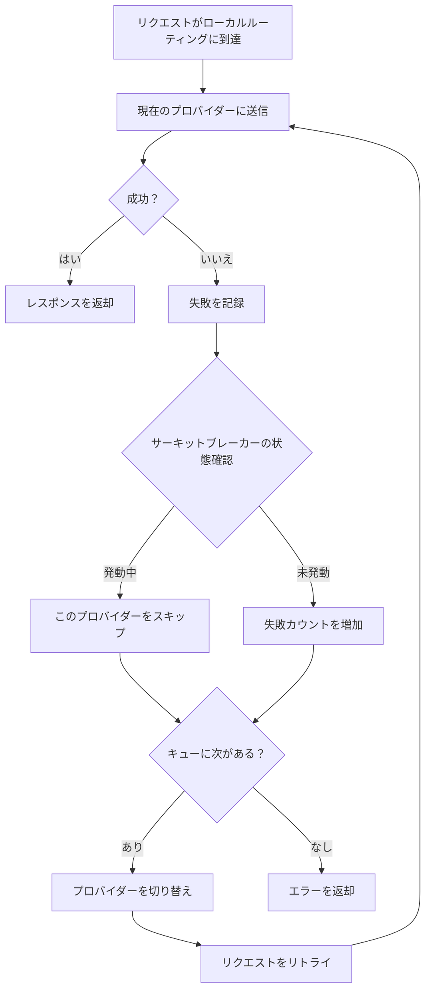
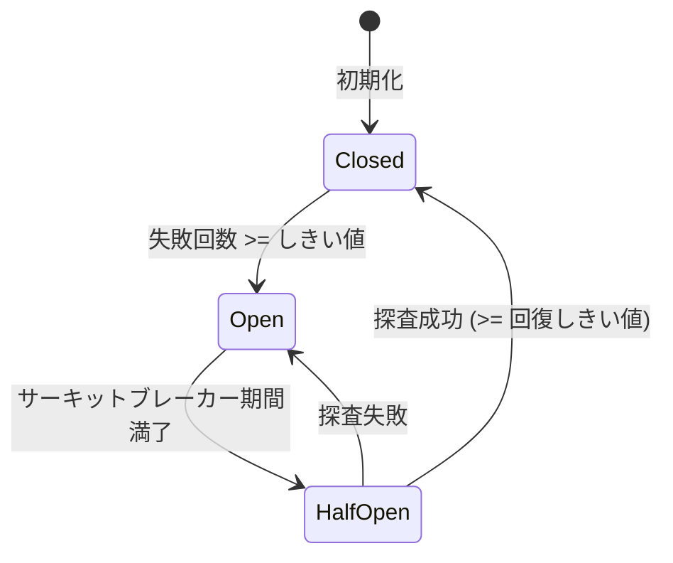

# 4.3 フェイルオーバー

## 機能説明

フェイルオーバー機能は、メインプロバイダーのリクエストが失敗した場合に、自動的にバックアッププロバイダーに切り替えてサービスの中断を防ぎます。

**適用シーン**：
- プロバイダーのサービスが不安定な場合
- 高可用性が必要な場合
- 長時間実行するタスク

## 前提条件

フェイルオーバー機能を使用するには：

1. ✅ アプリがルーティングモードに入っている（アプリページの「ルーティング」タブで「ルーティングを開始」をクリック）
2. ✅ 「ルーティング」タブでフェイルオーバーのスイッチをオンにする
3. ✅ キューにプロバイダーがある

フェイルオーバーは Claude Code、Codex、Gemini CLI、Grok Build の 4 つのアプリのみに対応しています。集約モードではフェイルオーバーしません（キューと設定は保持され、ルーティングモードに戻すと復元されます）。共存型アプリ（OpenCode、OpenClaw、Hermes、Pi、MiniMax Code）にはフェイルオーバーキューがありません。公式アカウントはキューに入れられません。クライアント自身のログインを使うため、ほかのプロバイダーと交代できないからです。

## フェイルオーバーの有効化

### 操作手順

1. アプリページで「ルーティング」タブに切り替え、そのアプリがルーティングモードになっていることを確認
2. タブバー右側の「フェイルオーバー」のヒントが付いたスイッチ（アイコンは交差する 2 本の矢印）をオンにする
3. 初回は確認ダイアログが表示されるので、「理解しました、有効にする」をクリック

<!-- TODO(v4 screenshot): Failover switch and "Routing settings" button on the right of the Routing tab bar on an app page -->

このスイッチは、アプリがすでにルーティングモードで、かつ「ルーティング」タブを表示しているときだけ現れます。

### スイッチの説明

| 状態 | 動作 |
|------|------|
| オフ | 選択した 1 つのプロバイダーにだけルーティングし、自動では切り替えない |
| オン | 直ちにキューの P1 に切り替え、リクエスト失敗時はキュー内の次のプロバイダーに自動的に切り替える。ステータス行に「キュー順」と表示される |

## フェイルオーバーキューの管理

フェイルオーバーをオンにすると、「ルーティング」タブのプロバイダーは 2 つのグループに分かれます：

- **キュー · 優先順**：リクエストはまず先頭（P1）に送られ、連続して失敗すると次に切り替わります
- **キュー外**：まだキューに入れていないプロバイダー

### バックアッププロバイダーの追加

「キュー外」で、プロバイダーカードの「キューに追加」をクリックします。

### 優先順位の調整

カードの上へ・下へボタン、またはカードのドラッグで順序を調整します。番号が小さいほど優先度が高く、キューの順序はホームのプロバイダー一覧の順序と同じです。

### プロバイダーの削除

キュー内のプロバイダーカードの「キューから外す」をクリックします。

## リトライ・タイムアウト・サーキットブレーカーの調整

パラメータはアプリごとに設定します。入口は 2 つあります：

- アプリページの「ルーティング」タブバー右側にある「ルーティング設定」ボタン：サイドパネルが開き、現在のアプリのパラメータを調整できます。パネル下部の「その他のルーティング設定」から設定ページに移動できます
- 「設定 → ローカルルーティング → 自動フェイルオーバー」：上部でアプリを選び、そのアプリのパラメータを調整します

パネルは「リトライとタイムアウト設定」と「サーキットブレーカー設定」の 2 つに分かれています。それぞれの意味は以下の各節を参照してください。

## フェイルオーバーのフロー

## サーキットブレーカーの設定

サーキットブレーカーは、失敗したプロバイダーへの頻繁なリトライを防止します。

### 設定項目

アプリごとに独立したデフォルト設定があります。以下は共通のデフォルト値で、Claude には独自の緩やかな設定があります。

| 設定 | 説明 | 共通デフォルト | Claude デフォルト | 範囲 |
|------|------|--------|--------|------|
| 失敗しきい値 | 連続何回失敗でサーキットブレーカーが発動 | 4 | 8 | 1-20 |
| 回復成功しきい値 | ハーフオープン状態で何回成功したら閉じるか | 2 | 3 | 1-10 |
| 回復待ち時間 | サーキットブレーカー発動後の復旧試行までの時間（秒） | 60 | 90 | 0-300 |
| エラー率しきい値 | この値を超えるとサーキットブレーカーが発動 | 60% | 70% | 0-100% |
| 最小リクエスト数 | エラー率計算前の最小リクエスト数 | 10 | 15 | 5-100 |

> 💡 Claude はリクエストに時間がかかるため、デフォルト設定はより緩やかで、多くの失敗を許容します。

### タイムアウト設定

| 設定 | 説明 | 共通デフォルト | Claude デフォルト | 範囲 |
|------|------|--------|--------|------|
| ストリーミング最初のバイトタイムアウト | 最初のデータチャンクの最大待機時間（秒） | 60 | 90 | 1-120 |
| ストリーミングアイドルタイムアウト | データチャンク間の最大間隔（秒） | 120 | 180 | 60-600（0 で無効化） |
| 非ストリーミングタイムアウト | 非ストリーミングリクエストの総タイムアウト時間（秒） | 600 | 600 | 60-1200 |

### リトライ設定

| 設定 | 説明 | 共通デフォルト | Claude デフォルト | 範囲 |
|------|------|--------|--------|------|
| 最大リトライ回数 | リクエスト失敗時のリトライ回数 | 3 | 6 | 0-10 |

> 💡 Gemini のデフォルト最大リトライ回数は 5 です。

### サーキットブレーカーの状態

| 状態 | 説明 |
|------|------|
| 閉（Closed） | 正常状態、リクエストを許可 |
| 開（Open） | サーキットブレーカー発動中、このプロバイダーをスキップ |
| 半開（Half-Open） | 復旧試行中、探査リクエストを送信 |

### 状態遷移

## ヘルスステータスの表示

### プロバイダーカード

ルーティングモードでは、プロバイダーカードにヘルスステータスバッジが表示されます：

| バッジ | 状態 | 説明 |
|------|------|------|
| 🟢 | 正常 | 連続失敗回数 0 |
| 🟡 | 低下 | 失敗はあるがサーキットブレーカー未発動 |
| 🔴 | サーキットオープン | 一時的にスキップ |

### キュー

フェイルオーバーキュー内のプロバイダーカードにも同じくヘルスステータスが表示されます。「転送中」のマークは、実際に使われているプロバイダーを示します（フェイルオーバーが成功すると切り替わるため、先頭とは限りません）。

## フェイルオーバーログ

各フェイルオーバーの記録内容：

| 情報 | 説明 |
|------|------|
| 時間 | 発生時刻 |
| 元のプロバイダー | 失敗したプロバイダー |
| 新しいプロバイダー | 切り替え先のプロバイダー |
| 失敗理由 | エラー情報 |

使用量統計のリクエストログで確認できます。

## ベストプラクティス

### キュー設定のアドバイス

1. **メインプロバイダー**：最も安定で高速なプロバイダー
2. **第 1 バックアップ**：次善の選択
3. **第 2 バックアップ**：最後の手段

### サーキットブレーカー設定のアドバイス

| シーン | 失敗しきい値 | サーキットブレーカー期間 |
|------|----------|----------|
| 高可用性要件 | 2 | 30 秒 |
| 一般的なシーン | 3 | 60 秒 |
| 偶発的な失敗を許容 | 5 | 120 秒 |

### 監視のアドバイス

定期的に確認：
- 各プロバイダーのヘルスステータス
- フェイルオーバーの発生頻度
- サーキットブレーカーの発動状況

## よくある質問

### フェイルオーバーがトリガーされない

確認事項：
1. ローカルルーティングが実行中か（設定 → ローカルルーティング）
2. アプリがルーティングモードか（集約モードではフェイルオーバーしません）
3. 「ルーティング」タブのフェイルオーバースイッチがオンか
4. キューにバックアッププロバイダーがあるか

### フェイルオーバーが頻繁にトリガーされる

考えられる原因：
- メインプロバイダーが不安定
- ネットワークの問題
- 設定のエラー

解決方法：
- メインプロバイダーの状態を確認
- サーキットブレーカーのパラメータを調整
- メインプロバイダーの変更を検討

### すべてのプロバイダーがサーキットブレーカー発動中

サーキットブレーカー期間の満了後に自動で復旧するのを待つか、以下を実行：
1. 「設定 → ローカルルーティング」でアプリをいったん直接接続に戻し、サービスを停止してからルーティングを開始し直す
2. またはサーキットブレーカーのパラメータを調整する
