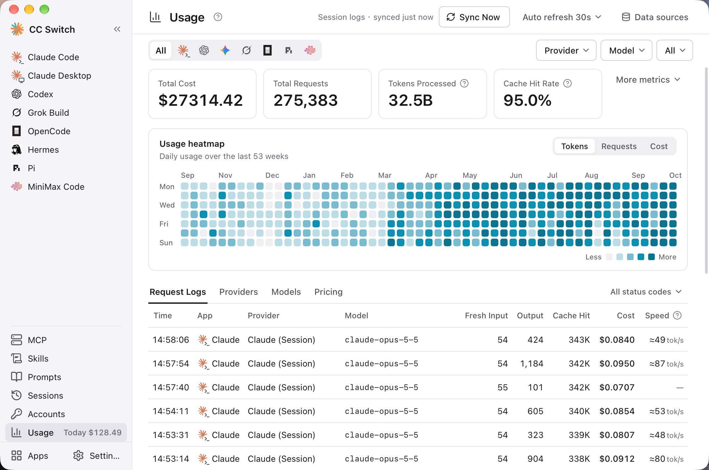

# 4.4 使用量統計

## 機能説明

使用量統計機能は、API リクエストデータを記録・分析して、以下をサポートします：

- API の使用状況の把握
- 費用支出の見積もり
- 使用パターンの分析
- 問題のトラブルシューティング

使用量統計はサイドバーにあるグローバルなページです。使用量データの取得元は 2 つあります：

| データ取得元                       | 対象範囲                                | ローカルルーティングの要否 |
| ---------------------------------- | --------------------------------------- | -------------------- |
| **ルーティングリクエストログ**     | ローカルルーティング経由で転送されたすべてのリクエスト | 必要                 |
| **CLI セッションログ**             | Claude Code、Codex、Gemini CLI、Grok Build、OpenCode、Pi、MiniMax Code のローカルのセッションログ | 不要                 |

- ローカルルーティングを有効にしなくても集計できます：CC Switch はデフォルトで各ツールのローカルのセッションログを定期的にスキャンし、プロバイダーとモデルごとにリクエスト数、Token、キャッシュヒット率、費用を集計します
- **Codex セッション**：JSONL セッションログから **精密に解析** し、モデル名を正規化することで料金検索の整合性を保証
- 使用量ページは **アプリ別フィルタリング** に対応し、データが混在しません
- OpenClaw と Hermes は現在、使用量統計に対応していません。Claude Desktop は、ローカルルーティング経由で転送された「モデルマッピング」リクエストのみを集計し、Claude Code のフィルターに含めます

## 前提条件

使用するデータ取得元によって前提条件が異なります：

**ルーティングリクエストログ**（ローカルルーティング経由で転送されたすべてのリクエストを対象）：

1. ✅ ローカルルーティングを起動
2. ✅ 対象アプリのルーティングをオン
3. ✅ 「リクエストの使用量を記録」をオン（デフォルトでオン。設定 → ローカルルーティング にあります）

**CLI セッションログ**（ローカルルーティング不要）：

1. ✅ 対応する CLI にセッション履歴ファイルがあること
2. ✅ 「セッションログを自動スキャン」をオンのままにする（デフォルトでオン）。オフにすると、「今すぐ同期」を押したときだけスキャンします
3. ✅ CC Switch は起動時に 1 回スキャンし、その後は 60 秒ごとにスキャンして使用量をインポートします

> セッションログからはどのプロバイダーか区別できないため、この種の記録のプロバイダー列には「{アプリ} · セッションログ」と表示されます。

## 使用量統計を開く

左サイドバーの **使用量** をクリックします。グローバルなページなので、先にアプリを選ぶ必要も、ローカルルーティングを起動する必要もありません。

ページ右上には次のものがあります：

- **今すぐ同期**：セッションログを今すぐ 1 回スキャンします（横に前回の同期時刻が表示されます）
- **自動更新**：ページデータの自動更新間隔を設定します。オフにもできます
- **データソース**：サイドパネルを開き、セッションログのスキャン、「リクエストの使用量を記録」、Codex 使用量メンテナンスを管理します（後述）

## 統計概要

### 集計カード

ページ上部に主要指標が表示されます：

| 指標 | 説明 |
|------|------|
| 総コスト | 料金設定に基づいて見積もった費用 |
| 総リクエスト数 | 統計期間内のリクエスト総数 |
| 実消費トークン | 新規入力 + 出力 + キャッシュ書き込み + キャッシュヒット |
| キャッシュヒット率 | キャッシュヒット ÷（新規入力 + キャッシュ書き込み + キャッシュヒット） |

「その他の指標」をクリックすると、新規入力・出力・キャッシュ書き込み・キャッシュヒットの内訳が展開されます。一部のプロトコル（OpenAI など）はキャッシュ書き込みを報告しないため、キャッシュ書き込みと実消費が少なめに出ることがあります。

期間、アプリ、プロバイダー、モデルのフィルターを切り替えると、これらの数値も同時に更新され、下部のログや統計一覧と整合します。

### 期間とフィルター

| 期間 | 説明 |
|------|------|
| 当日 | 当日 00:00 から現在まで |
| 過去 24 時間 / 過去 7 日間 / 過去 14 日間 / 過去 30 日間 | 直近のそれぞれの期間 |
| すべて | 全履歴 |
| カレンダーフィルター | 開始と終了の日付・時刻を自由に指定 |

フィルター行では次の操作ができます：

- アプリでフィルタリング：すべて / Claude Code / Codex / Gemini / OpenCode / Grok Build / Pi / MiniMax Code（ローカルルーティング経由の Claude Desktop のリクエストは Claude Code に含まれます）
- プロバイダーとモデルのドロップダウンでフィルタリング（モデル一覧は選択したプロバイダーに連動します）

OpenClaw と Hermes は現在、使用量統計に対応していません。

## ヒートマップとトレンドグラフ

### 使用量ヒートマップ

過去 53 週間の日別使用量を表示します。色が濃いほど使用量が多いことを示します。

### 利用トレンド

折れ線グラフで時間に伴う変化を表示します。**Tokens / リクエスト / コスト** の 3 つの指標を切り替えられます：

- 過去 24 時間（および当日）：時間単位で表示
- 7 日間、30 日間などより長い範囲：日単位で表示
- マウスを重ねると、その時点の具体的な数値を確認できます

> 💡 **キャッシュ Token の説明**：Anthropic API は Prompt Caching をサポートしています。キャッシュ作成時は高い料金（通常、入力価格の 1.25 倍）がかかりますが、その後のキャッシュヒット時は 0.1 倍の価格のみで、繰り返しリクエストのコストを大幅に削減できます。

## 詳細データ

ページ下部には 4 つのタブがあります：**リクエストログ**、**プロバイダー**、**モデル**、**料金**（料金は次の節を参照）。

### リクエストログ

各リクエストの記録：

| フィールド | 説明 |
|------|------|
| 時間 | リクエスト時刻 |
| アプリ | 所属アプリ |
| プロバイダー | 使用されたプロバイダー名（セッションログからインポートしたものは「{アプリ} · セッションログ」と表示） |
| モデル | リクエストされたモデル |
| 新規入力 | キャッシュを含まない入力 Token 数 |
| 出力 | 出力 Token 数 |
| キャッシュヒット | キャッシュヒットの Token 数 |
| コスト | 見積もり費用（ドル）。料金のないモデルは「価格未設定」と表示 |
| 速度 | 1 秒あたりの出力トークン数（後述） |

マウスを重ねると、所要時間、最初のトークンまでの時間、キャッシュ書き込みなどの詳細を確認できます。リクエスト行をクリックすると詳細パネルが開き、ソース（ルーティングサービスとステータスコード、またはセッションログ）、トークン使用量、コスト内訳、パフォーマンス情報を確認できます。表の右上のステータスコードフィルターで、特定のステータスコードのリクエストだけを表示できます。

#### 速度の計算方法

速度は 1 秒あたりに出力されるトークン数で、最初のトークンから終了までで計算します。ローカルルーティング経由で、出力が 100 トークン以上のリクエストだけが対象です。思考過程が外部に出ないモデルでは近似値になります。

ルーティングを使っていない場合、速度はセッションログのタイムスタンプから推定され、「≈ xx tok/s」と表示されます。最初のトークンの計測がなく、最初のトークンを待つ時間も含まれるため低めに出ます。また、出力が 200 トークン以上のリクエストだけが推定対象です。

### プロバイダー

プロバイダー別の集計：リクエスト数、トークン、コスト、成功率、速度。

### モデル

モデル別の集計：リクエスト数、トークン、コスト、平均コスト、成功率、速度。

## データソースパネル

ページ右上の「データソース」をクリックして開きます：

- **セッションログを自動スキャン**：スイッチで、「今すぐ同期」もできます。パネルには対象アプリと、「Hermes と OpenClaw は使用量統計にまだ対応していません」という注記が表示されます
- **リクエストの使用量を記録**：オンかどうかを表示し、「変更」をクリックすると 設定 → ローカルルーティング に移動して調整できます
- **Codex 使用量メンテナンス**：「Codex 使用量を再構築」は、既存の Codex セッションの明細と集計を消去し、ローカルの Codex ログから再インポートします。再構築の前にデータベースが自動でバックアップされます。すでに削除されたログに対応する履歴は再インポートできません

## 料金設定

### 料金設定を開く

使用量ページ → **料金** タブ

ページ上部の「課金のデフォルト設定」で、各アプリが「リクエストモデル」と「応答モデル」のどちらで料金を照合するかを決めます。「変更」をクリックして調整します。ルーティング経由のリクエストにのみ適用され、セッションログから取り込んだ使用量はログに記録されたモデルで計算します。

下にあるのが「モデル料金」の表です。手動で入力するほか、「価格設定を追加」/「価格設定を編集」ダイアログで「models.dev からインポート」をクリックして、公開されているモデル料金をインポートすることもできます。

### モデル価格の設定

各モデルの価格を設定（100 万 Token あたり）：

| フィールド | 説明 |
|------|------|
| モデル ID | モデル識別子（例：claude-3-sonnet） |
| 表示名 | カスタム表示名 |
| 入力価格 | 100 万入力 Token あたりの価格 |
| 出力価格 | 100 万出力 Token あたりの価格 |
| キャッシュ読取価格 | 100 万キャッシュヒット Token あたりの価格 |
| キャッシュ作成価格 | 100 万キャッシュ作成 Token あたりの価格 |

### モデル ID の正規化ルール

料金を照合する前に、CC Switch はリクエスト内のモデル ID を正規化します：

- 最後の `/` より前の接頭辞を削除し、小文字に変換
- `:` 以降の接尾辞を削除し、末尾の `[1m]` を削除
- `@` を `-` に置換
- 一般的なラッパー接頭辞、バージョン接尾辞、日付接尾辞（`-YYYY-MM-DD`、`-YYYYMMDD`）を削除
- 一部のモデルファミリーでは、短い ID からバージョン付き価格エントリに照合できます

料金設定では、リクエスト内の完全な元のモデル名ではなく、正規化後のモデル ID を入力してください。

| 元のモデル名 | 入力するモデル ID | 説明 |
|------|------|------|
| `stepfun-ai/step-3.5-flash` | `step-3.5-flash` | プロバイダー接頭辞を削除 |
| `moonshotai/kimi-k2-0905:exa` | `kimi-k2-0905` | 接頭辞と `:` 以降を削除 |
| `gpt-5.2-codex@low` | `gpt-5.2-codex-low` | `@` を `-` に置換 |
| `OpenAI/GPT-5.5-2026-05-14` | `gpt-5.5` | 接頭辞と日付接尾辞を削除 |
| `anthropic/claude-opus-4.8` | `claude-opus-4-8` | 接頭辞を削除し、ドット形式に照合 |
| `global.anthropic.claude-opus-4-8-v1:0` | `claude-opus-4-8` | ラッパー接頭辞、バージョン接尾辞、`:` 以降を削除 |
| `claude-haiku-4-5` | `claude-haiku-4-5-20251001` | 短い ID からバージョン付き価格に照合 |

### 操作

- **追加**：「追加」ボタンで新しいモデル価格を追加
- **編集**：行末の編集アイコンで変更
- **削除**：行末の削除アイコンで削除

料金タブには「models.dev 料金の自動同期」もあります。オンにすると、CC Switch は起動時（最大 6 時間に 1 回）に、選んだモデルの価格を models.dev から更新します。同じモデル ID の組み込み価格と手動で設定した価格は上書きされるため、オンにする前に確認ダイアログが表示されます。「モデルを選択」で選ぶこともでき、よく使うモデルを自動的に含めることもできます。

<!-- TODO(v4 screenshot): Usage page "Pricing" tab (billing defaults + model pricing table) -->

### プリセット価格

CC Switch は一般的なモデルの公式価格（100 万 Token あたり）をプリセットしています。v3.13.0 では一部モデルの **CNY → USD 価格を修正** し、これまで欠けていたモデル定義を補完したほか、**MiniMax のプランクォータ計算** と **0% → 100% の使用進捗** 表示を修正し、費用見積もりとプラン進捗の表示がより正確になりました。

**Claude シリーズ（ドル）**：

| モデル | 入力 | 出力 | キャッシュ読取 | キャッシュ作成 |
|------|------|------|----------|----------|
| **Claude 4.8 シリーズ** | | | | |
| claude-opus-4-8 | $5 | $25 | $0.50 | $6.25 |
| **Claude 4.5 シリーズ** | | | | |
| claude-opus-4-5 | $5 | $25 | $0.50 | $6.25 |
| claude-sonnet-4-5 | $3 | $15 | $0.30 | $3.75 |
| claude-haiku-4-5 | $1 | $5 | $0.10 | $1.25 |
| **Claude 4 シリーズ** | | | | |
| claude-opus-4 | $15 | $75 | $1.50 | $18.75 |
| claude-opus-4-1 | $15 | $75 | $1.50 | $18.75 |
| claude-sonnet-4 | $3 | $15 | $0.30 | $3.75 |
| **Claude 3.5 シリーズ** | | | | |
| claude-3-5-sonnet | $3 | $15 | $0.30 | $3.75 |
| claude-3-5-haiku | $0.80 | $4 | $0.08 | $1.00 |

**OpenAI シリーズ / Codex（ドル）**：

| モデル | 入力 | 出力 | キャッシュ読取 |
|------|------|------|----------|
| **GPT-5.2 シリーズ** | | | |
| gpt-5.2 | $1.75 | $14 | $0.175 |
| **GPT-5.1 シリーズ** | | | |
| gpt-5.1 | $1.25 | $10 | $0.125 |
| **GPT-5 シリーズ** | | | |
| gpt-5 | $1.25 | $10 | $0.125 |

> 注：Codex プリセットには low/medium/high などの変種が含まれており、価格はベースモデルと同一です。

**Gemini シリーズ（ドル）**：

| モデル | 入力 | 出力 | キャッシュ読取 |
|------|------|------|----------|
| **Gemini 3 シリーズ** | | | |
| gemini-3-pro-preview | $2 | $12 | $0.20 |
| gemini-3-flash-preview | $0.50 | $3 | $0.05 |
| **Gemini 2.5 シリーズ** | | | |
| gemini-2.5-pro | $1.25 | $10 | $0.125 |
| gemini-2.5-flash | $0.30 | $2.50 | $0.03 |

**中国メーカーのモデル**：

> 注: 通貨は各プロバイダーの公式料金ページに従います。StepFun は現在 USD 表記です。
>
> **DeepSeek 互換**: 旧モデル名 `deepseek-chat` / `deepseek-reasoner` は `deepseek-v4-flash`（非思考／思考モード）と等価になり、v4-flash 料金で課金されます。

| モデル | 入力 | 出力 | キャッシュ読取 |
|------|------|------|----------|
| **StepFun** | | | |
| step-3.5-flash | $0.10 | $0.30 | $0.02 |
| **DeepSeek** | | | |
| deepseek-v4-flash | ¥1.00 | ¥2.00 | ¥0.20 |
| deepseek-v4-pro | ¥12.00 | ¥24.00 | ¥1.00 |
| **Kimi (月之暗面)** | | | |
| kimi-k2-thinking | ¥4.00 | ¥16.00 | ¥1.00 |
| kimi-k2 | ¥4.00 | ¥16.00 | ¥1.00 |
| kimi-k2-turbo | ¥8.00 | ¥58.00 | ¥1.00 |
| **MiniMax** | | | |
| minimax-m2.1 | ¥2.10 | ¥8.40 | ¥0.21 |
| minimax-m2.1-lightning | ¥2.10 | ¥16.80 | ¥0.21 |
| **その他** | | | |
| glm-4.7 | ¥2.00 | ¥8.00 | ¥0.40 |
| doubao-seed-code | ¥1.20 | ¥8.00 | ¥0.24 |
| mimo-v2-flash | 無料 | 無料 | - |

### カスタム価格

中継サービスを使用する場合、価格が異なる場合があります：

1. 「編集」ボタンをクリック
2. 価格を変更
3. 保存

## よくある質問

### 統計データが空

確認事項：
- 「セッションログを自動スキャン」がオンになっているか、対応する CLI にセッション履歴があるか（ローカルルーティングを使わない場合のデータ取得元）
- ルーティングリクエストログを使う場合：ローカルルーティングが実行中か、対象アプリのルーティングが有効か、「リクエストの使用量を記録」がオンか
- そのアプリが使用量統計に対応しているか（OpenClaw と Hermes は現在非対応）

### 費用の見積もりが不正確

考えられる原因：
- 料金設定が実際と異なる
- 中継サービスの特別な料金体系を使用

解決方法：
- 料金設定を更新
- プロバイダーの実際の請求書を参照

### Token 数がプロバイダーと一致しない

CC Switch は独自の方法で Token 数を推定しており、プロバイダーの計算方法と若干の差異が生じる場合があります。プロバイダーの請求書を基準にしてください。
