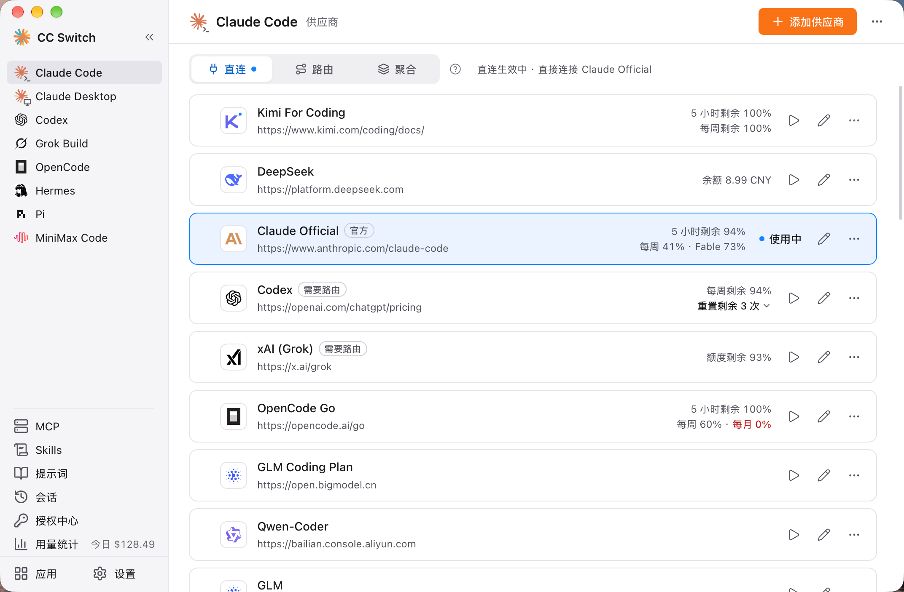

# 1.3 界面概览

## 主界面布局

主窗口分成左侧栏和右侧内容区：

- **左侧栏**：选择要管理的应用，或进入全局功能页
- **内容区**：顶部是页头（应用名、「添加供应商」按钮和 ⋯ 菜单），下面是当前页的内容

## 左侧栏

左侧栏从上到下分三块：

| 区域 | 内容 |
|------|------|
| 应用列表 | 你选择显示的受管应用（最多 10 个）。点一个应用，右侧显示它的供应商页。应用名旁的小标记表示它当前用的是路由、聚合或模型映射，出问题时会提示「需要处理」 |
| 全局页 | MCP、Skills、提示词、会话、授权中心、用量统计（有今日花费时会在旁边显示「今日 $xx」）。这些页面不属于某个应用，每个只有一个入口 |
| 底部 | 「应用」（安装、升级、选择在侧栏显示哪些应用）和「设置」 |

点侧栏顶部的收起按钮，侧栏会缩成只剩图标；再点一次展开。「应用」或「设置」旁出现圆点，表示有命令行工具或 CC Switch 本身有新版本。

> 快捷键 `Cmd/Ctrl + ,` 随时打开设置。

### 受管应用

- **Claude Code** - 管理 Claude Code 配置
- **Claude Desktop** - 管理 Claude Desktop 第三方供应商与官方模式
- **Codex** - 管理 Codex 配置
- **Gemini** - 管理 Gemini CLI 配置
- **Grok Build** - 管理 Grok Build 配置
- **OpenCode** - 管理 OpenCode 配置
- **OpenClaw** - 管理 OpenClaw 配置
- **Hermes** - 管理 Hermes Agent 供应商与记忆
- **Pi** - 管理 Pi 的供应商与模型
- **MiniMax Code** - 管理 MiniMax Code 的自定义供应商

不常用的应用可以在侧栏的「应用」页里关掉显示。关掉后它不再出现在侧栏，也不出现在 MCP / Skills 的应用列和提示词、会话的应用下拉里，已有配置不受影响。

### 全局页

| 入口 | 用途 |
|------|------|
| MCP | 管理 MCP 服务器，并按应用启用，见 [3.1 MCP](../3-extensions/3.1-mcp.md) |
| Skills | 安装和管理技能，见 [3.3 Skills](../3-extensions/3.3-skills.md) |
| 提示词 | 管理系统提示词，见 [3.2 Prompts](../3-extensions/3.2-prompts.md) |
| 会话 | 浏览、搜索各工具的会话历史 |
| 授权中心 | 集中管理 ChatGPT（Codex）、GitHub Copilot、xAI 等 OAuth 账号 |
| 用量统计 | 请求统计概览、趋势图、请求日志、供应商/模型统计和成本定价 |

不是每个应用都支持所有功能：Claude Desktop 和 OpenClaw 不在 MCP、Skills 里；Claude Desktop 页面上的 MCP、Skills、提示词、会话操作的是 Claude Code 的数据。

## 应用页

### 应用页页头

页头显示应用名和页面名（如「Claude Code 供应商」），右侧是：

- **添加供应商**：添加新的供应商
- **项目切换**：默认隐藏，可在「设置 → 通用 → 侧栏与页头」打开「显示项目切换」（MiniMax Code 页面没有）
- **⋯ 菜单**：查看会话、配置目录、安装与升级、在侧栏隐藏、查看此应用的用量
- Hermes 页头还有「Web UI」按钮

OpenClaw 和 Hermes 在页头下有一排页签，可以在供应商页和它们的专属页之间切换：

| 应用 | 页签 |
|------|------|
| OpenClaw | 供应商、工作区、配置 |
| Hermes | 供应商、记忆 |

### 连接模式

Claude Code、Codex、Gemini CLI、Grok Build 的供应商页顶部有 **直连 / 路由 / 聚合** 三个标签（聚合只有 Claude Code 和 Codex 有；Claude Desktop 的是直连 / 模型映射）。标签上的圆点表示当前生效的模式，旁边的文字写明现在连的是哪一家。

点标签只是查看那个模式下的列表，不会改配置。要真正切换，点下方写明后果的按钮：「开始路由」、「切换到聚合模式」、「回到直连」。路由见 [4.2 路由](../4-proxy/4.2-routing.md)，聚合见 [4.6 聚合模式](../4-proxy/4.6-aggregation.md)。

### 供应商卡片

每个供应商是一张卡片，从左到右包含：

| 元素 | 功能说明 |
|------|----------|
| 拖拽手柄 | 拖动调整供应商顺序（悬停时出现） |
| 供应商图标 | 品牌图标 |
| 供应商信息 | 名称、备注或端点地址，点击可打开官网；名称旁可能有「官方」「需要路由」等标签 |
| 用量信息 | 剩余额度或余额，多套餐时显示多行 |
| 状态 / 主操作 | 当前生效的卡片显示「使用中」（路由模式下是「路由中」）；其他卡片是一个播放按钮，直连下用于切换，路由下用于「路由到此」，聚合下用于设为默认或添加 |
| 编辑按钮 | 编辑供应商配置 |
| ⋯ 更多 | 复制、检测连通、配置用量查询、打开终端（仅 Claude Code）、删除 |

正在使用的供应商不能删除，需先切到别家。「检测连通」只探测地址是否可达，不发送真实模型请求；官方供应商和 MiniMax Code 的供应商上不可用。Copilot、Codex OAuth、xAI OAuth 等额度自动显示的供应商没有「配置用量查询」。

**「需要路由」** 标签表示这个供应商必须经本地路由才能用（例如接口格式需要转换），直连切换过去客户端会无法使用它；**官方订阅不经过路由**（Codex 的 OpenAI Official 例外），路由模式下不能切到它。

OpenCode、OpenClaw、Hermes、Pi、MiniMax Code 是「共存」式应用，卡片上的按钮是「添加 / 移除」（Pi 是「启用 / 移除」），没有直连 / 路由 / 聚合标签。

### 故障转移队列与健康状态

在路由模式下，供应商页分成「队列 · 按优先级」和「不在队列」两部分。队列里的供应商按顺序接请求，前一位连续失败时自动换到下一位，可用上移、下移或拖动调整顺序；设置方法见 [4.3 故障转移](../4-proxy/4.3-failover.md)。

队列里的供应商会显示健康状态：

| 状态 | 说明 |
|------|------|
| 正常 | 连续失败 0 次 |
| 降级 | 有失败但未触发熔断 |
| 熔断 | 已触发熔断，暂时跳过（阈值见 [4.3 故障转移](../4-proxy/4.3-failover.md#熔断器配置)） |

### 应用管理页

侧栏底部的「应用」页用来管理命令行工具：

- 查看每个工具的当前版本和最新版本，安装未装的，升级已装的
- 选择哪些应用显示在侧栏
- 「手动安装命令」可复制各工具的安装命令

Claude Desktop 是桌面应用，不能在这里安装或升级，页面只显示它是否已接入。启动时是否检查新版本由「设置 → 通用 → 各应用的新版本」控制。

## 系统托盘

CC Switch 在系统托盘显示图标，提供快速操作入口。

<!-- TODO(v4 截图): 展开后的托盘菜单（含 Claude Code / Codex 等应用子菜单） -->

### 托盘菜单

| 菜单项 | 功能 |
|--------|------|
| 打开 CC Switch | 显示主窗口并聚焦，始终在最上面 |
| 应用子菜单 | Claude Code、Claude Desktop、Codex、Gemini CLI、Grok Build 五个切换式应用各一个子菜单，标题显示当前供应商和模式；子菜单里点供应商即可切换，当前的带勾选标记，还可以打开该应用页面或添加供应商，部分应用会显示额度摘要 |
| 项目 | 切换项目（整套供应商、MCP、Skills、提示词状态），仅在开启「显示项目切换」后出现 |
| 轻量模式 | 勾选框，进入或退出仅托盘运行模式 |
| 打开官方网站 | 在浏览器中打开 ccswitch.io |
| 退出 CC Switch | 完全退出应用。有应用在用路由或聚合时，菜单项会写明「路由服务会停止」 |

路由服务没启动、某个应用切换失败等问题，会显示在菜单最上方，托盘图标上也会出现一个小圆点。

> **注意**：累加式（共存）应用（OpenCode、OpenClaw、Hermes、Pi、MiniMax Code）不进托盘，请在主界面里操作。没有配置供应商的应用在子菜单里会显示相应提示。托盘里显示哪些应用，由「应用」页的显示开关决定。

### 多语言支持

托盘菜单跟随界面语言，支持简体中文、繁體中文、English、日本語；还没设置过语言时按系统语言。

### 轻量模式

托盘菜单包含 **轻量模式** 勾选框。启用后：

- 主窗口关闭以释放资源
- 应用仅在系统托盘中运行
- 你仍可通过托盘子菜单切换供应商
- 在 macOS 上，Dock 图标也会隐藏

要退出轻量模式，取消勾选该选项或点击「打开 CC Switch」，主窗口将被重建并显示。

### 使用场景

托盘切换供应商无需打开主界面，适合：

- 频繁切换供应商
- 主窗口最小化时快速操作
- 后台运行时管理配置
- 使用轻量模式以最小化资源占用

## 设置

点侧栏底部的「设置」，侧栏会换成设置目录，右侧显示当前分组；点「返回」或按 `Esc` 回到主界面。设置分为 6 个分组：

### 通用

- **外观**：界面语言（简体中文/繁體中文/English/日本語）、明暗主题（跟随系统/浅色/深色）
- **侧栏与页头**：在侧栏显示哪些应用（跳转到「应用」页）、显示项目切换
- **各应用的新版本**：启动时检查各应用的新版本
- **窗口与终端**：开机自启、关闭按钮的行为（隐藏到托盘或退出）、首选终端

### 应用配置

- 各应用的配置目录覆盖（Claude Desktop 和 MiniMax Code 除外）
- 各应用自己的选项，如 Claude Code 的「应用到 Claude Code 插件」「跳过 Claude Code 初次安装确认」，Codex 的非接管切换时保留官方登录

### 本地路由

- 服务：监听地址与端口、启停
- 正在使用路由的应用
- 自动故障转移
- 整流器
- 全部退出路由

### 网络

- 全局出站代理

### 数据

- 存储位置（CC Switch 配置目录）
- 数据管理（SQL 导入导出）
- 备份与恢复（含「其他备份」总览）
- 云同步
- 应用诊断日志

### 关于

- 版本信息、检查更新
- GitHub、官方网站、发行说明

## 快捷键

| 快捷键 | 功能 |
|--------|------|
| `Cmd/Ctrl + ,` | 打开设置 |
| `Cmd/Ctrl + F` | 搜索供应商（在供应商页） |
| `Esc` | 关闭搜索；在设置页返回主界面 |

## 搜索功能

在供应商页按 `Cmd/Ctrl + F` 打开搜索框：

- 支持按名称、备注、网址搜索
- 实时过滤供应商列表
- 按 `Esc` 关闭搜索
