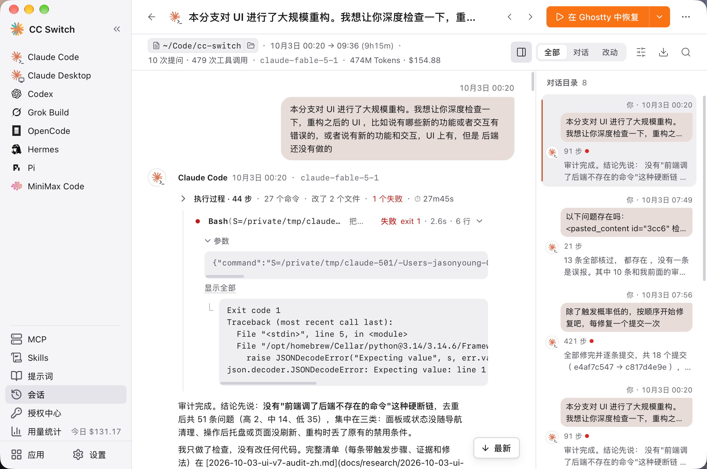

# 3.4 会话管理器

会话管理器可让你在一处浏览、搜索和管理所有支持的 CLI 工具的对话会话。

## 支持的应用

| 应用 | 会话存储位置 |
|------|-------------|
| Claude Code | `~/.claude/projects/<项目目录>/*.jsonl` |
| Codex | `~/.codex/sessions/` 与 `~/.codex/archived_sessions/` |
| Gemini CLI | `~/.gemini/tmp/<project>/chats/` |
| Grok Build | `~/.grok/sessions/` 与 `~/.grok/archived_sessions/` |
| OpenCode | `~/.local/share/opencode/`（JSON 或 SQLite） |
| OpenClaw | `~/.openclaw/agents/<agent>/sessions/*.jsonl` |
| Hermes | `~/.hermes/state.db` 或 `~/.hermes/sessions/*.jsonl` |
| Pi | `~/.pi/agent/sessions/` |
| MiniMax Code | `~/.minimax/v2/sqlite/runtime-state.sqlite` |

如果在设置中覆盖了配置目录，会话目录随之变化（OpenCode 的会话位于 XDG 数据目录 `~/.local/share/opencode`，不受配置目录覆盖影响）。MiniMax Code 的数据目录可用环境变量 `MINIMAX_DATA_DIR` 指定，Pi 另外识别 `PI_CODING_AGENT_DIR`。

## 打开会话管理器

点击左侧栏的 **会话**。它是全局页：打开后默认显示当前应用的会话，可以用页面左上角的应用下拉框切换到其他应用或「全部应用」（每项后面显示该应用的会话数）。

> **注意**：Claude Desktop 没有单独的会话记录，从它的页面进入时显示的是 Claude Code 的会话。Hermes 的会话也在下拉框里选，页面会提示「Hermes 只显示最近 500 个会话」。

## 界面布局

会话管理器分为两个层级：

- **会话列表**：顶部是应用下拉框、搜索框和「按时间 / 按项目」分组切换，下面是会话列表
- **会话详情**：点任意一行进入，整页显示这个会话的对话内容，点「返回会话列表」回到列表；也可以用「上一个 / 下一个」在会话之间切换

页头右侧的 ⋯ 菜单有：刷新列表、选择多个…、首选终端…（跳到设置）、会话记录在哪里…（列出各应用的会话存放位置）。

### 会话列表

每个会话条目显示：
- 应用图标
- 会话标题
- 最近活跃时间和创建时间
- 最后一条消息的摘要
- 右侧的「恢复」「复制恢复命令」按钮和 ⋯ 菜单

### 会话详情

进入会话后可以看到：
- **标题和项目目录**：目录可点击复制完整路径
- **恢复**按钮和更多恢复方式（如复制「进入目录并恢复」命令）
- **对话内容**：按提问和回复分轮显示，AI 执行过程（命令、读写文件、改动）收成一条可展开的「执行过程」
- **视图切换**：全部 / 对话 / 改动，只看对话或只看文件改动
- **对话目录**：快速跳到某次提问
- **查找**：在当前会话内查找
- **复制 / 导出**：复制整段为 Markdown，或导出为 Markdown 文件

## 搜索与过滤

### 全文搜索

使用页面顶部的搜索框，可搜索以下内容：
- 标题
- 项目目录
- 首末消息
- 会话 ID

搜索框可搜索标题、目录、首末消息或会话 ID，实时过滤结果。按 **Esc** 清除搜索。

### 按应用过滤

点击左上角的应用下拉框，选择：
- **全部应用** — 显示所有应用的会话（包括 Hermes）
- Claude Code、Codex、OpenCode、Hermes、Gemini CLI、Pi、Grok Build、OpenClaw、MiniMax Code

会话列表还可以用右侧的分段控件在「按时间」（今天 / 昨天 / 本周 / 更早）和「按项目」两种分组之间切换。

过滤可与搜索组合使用。

### 刷新

点击页头 ⋯ 菜单里的「刷新列表」，重新扫描各应用目录以发现新增或已删除的会话。

## 会话操作

### 恢复会话

点击会话行（或会话详情）上的 **恢复** 按钮继续对话。

**macOS 上**：
- CC Switch 使用你偏好的终端启动恢复命令
- 终端会在会话的项目目录中打开
- 如果终端启动失败，命令会被复制到剪贴板
- 首选终端可以在页头 ⋯ 菜单的「首选终端…」里更换

**支持的终端（macOS）**：Terminal.app、iTerm2、Ghostty、Otty、Kitty、WezTerm、Kaku、Alacritty、Warp

**其他平台**：
- 恢复命令会被复制到剪贴板
- 在终端中粘贴即可恢复会话

> 如果会话没有可用的恢复命令，恢复按钮将被禁用。OpenClaw 会话由网关管理、Hermes 会话暂不支持命令行恢复，都不能在这里恢复。Codex 按供应商分开保存历史，切换过供应商后，旧会话可能无法继续。

恢复时，终端会在会话原来的项目目录中打开。如果想在其他目录用某个 Claude 供应商打开终端，可以使用 Claude 供应商卡片上的「打开终端」按钮，它会先让你选择工作目录。

### 删除会话

点击会话行 ⋯ 菜单里的「删除」，永久删除会话文件。会从磁盘上直接删除，不经过废纸篓，无法撤销；删除前会显示确认对话框，说明具体会删什么。

> 没有本地源路径的会话无法删除；MiniMax Code 的会话请在 MiniMax Code 中删除。

### 批量操作

批量管理多个会话：

1. 点击页头 ⋯ 菜单里的 **选择多个…**
2. 使用出现的复选框选择会话
3. 使用 **全选匹配结果** 选择所有过滤结果，或点 **清空** 取消选择，点 **退出选择** 结束批量模式
4. 点击「删除 N 个会话」删除所有选中的会话

删除前会显示确认对话框并展示数量。结果会报告成功删除的数量和失败的数量。

## 对话历史

### 消息显示

对话按「提问—回复」分轮显示：
- 你的提问和 AI 的最终回复正常显示
- AI 的执行过程（运行命令、读取或修改文件、调用 MCP、子代理等）收成一条「执行过程 · N 步」，可展开看每一步的参数、输出和文件改动；失败的步骤会标出
- 思考内容单独标出（部分工具的思考内容不可见）
- 较长的内容默认折叠，可「展开完整内容」；超过 2 MB 的内容请复制源文件路径后在本地查看

### 目录导航

「对话目录」列出这次会话里的每次提问（含步数、是否有失败或中断），点任意一条跳到对应位置。

## 提示

- 会话按最后活跃时间排序（最新在前）
- 应用下拉框里的会话数会随搜索实时更新
- OpenCode 会话可能来自 JSON 文件和 SQLite 数据库 — 重复项会自动去重
