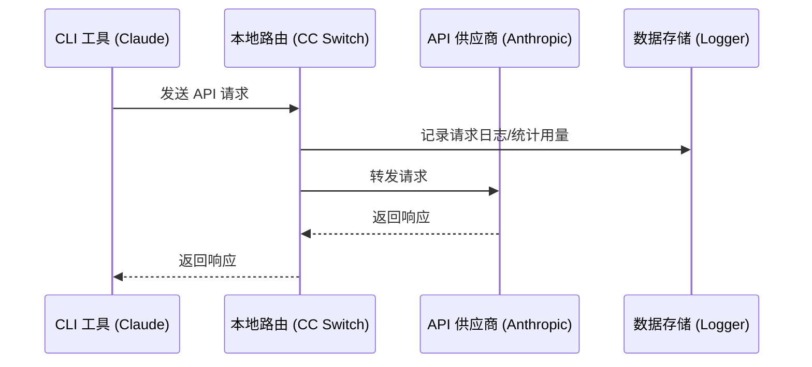

# 4.1 本地路由服务

## 功能说明

本地路由在本机启动一个 HTTP 服务。让某个应用进入路由模式后，该应用的 API 请求会先发到 CC Switch，再由 CC Switch 转发给当前供应商。

**主要用途**：
- 转换接口格式：让 Claude Code 使用 OpenAI 或 Gemini 格式的供应商，让 Codex、Grok Build 使用 Chat Completions 或 Anthropic Messages 格式的供应商
- 自动故障转移：当前供应商请求失败时，按队列切换到备用供应商
- 热切换：切换供应商后立即作用于后续请求
- 记录每次请求的用量与状态

支持本地路由的应用：**Claude Code**、**Codex**、**Gemini CLI**、**Grok Build**。Claude Desktop 的「模型映射」模式也经由本地路由转发，详见 [2.6 Claude Desktop](../2-providers/2.6-claude-desktop.md)。

> 💡 统计用量不一定要开启本地路由：不开路由时，CC Switch 也会从各工具的本地会话记录统计用量，详见 [4.4 用量统计](./4.4-usage.md)。

## 启动本地路由

本地路由服务一般不需要手动启动：

- 在应用页（侧栏里选一个应用）顶部切到「路由」标签，点击「开始路由」，确认后该应用开始经本地路由转发，服务没在运行会自动启动。路由、聚合两种模式下，请求都先经过本机的路由服务
- Claude Desktop 使用「模型映射」的供应商时，服务也会自动启动并保持运行，详见 [2.6 Claude Desktop](../2-providers/2.6-claude-desktop.md)

点击顶部的「直连 / 路由 / 聚合」标签只是查看，不会改配置；真正切换要点标签下写明后果的按钮（「开始路由」「切换到聚合模式」「回到直连」）。

<!-- TODO(v4 截图): 应用页顶部「直连 / 路由 / 聚合」标签，选中「路由」且未生效，显示「开始路由」按钮 -->

也可以在「设置 → 本地路由」的「服务」区域手动点「启动」。服务没在运行、而某个应用处于路由或聚合模式时，应用页会提示「路由服务没有运行，请求会失败」，并提供「启动服务」和「回到直连」两个按钮。

<!-- TODO(v4 截图): 设置 → 本地路由页，服务区域（运行状态、统计、监听地址与端口、记录请求用量） -->

## 路由配置

### 基础配置

在「设置 → 本地路由 → 服务」中：

| 配置项 | 说明 | 默认值 |
|--------|------|--------|
| 监听地址 | 本地路由绑定的 IP 地址，支持 IPv4、IPv6 和 `localhost` | `127.0.0.1` |
| 监听端口 | 本地路由监听的端口（1024–65535） | `15721` |
| 记录请求用量 | 将路由请求的用量与状态写入本地统计数据库；关闭后用量统计里没有经路由的请求明细 | 开启 |

重试次数和超时时间按应用配置，见 [4.3 故障转移](./4.3-failover.md)。

### 修改配置

1. 在「监听地址与端口」中修改地址或端口
2. 点击「保存并重启服务」（有改动时才可点）

保存后服务会自动重启并使用新的地址和端口。

### 监听地址说明

| 地址 | 说明 |
|------|------|
| `127.0.0.1` | 仅本机可访问（推荐） |
| `0.0.0.0` | 允许局域网访问 |

## 运行状态

「设置 → 本地路由 → 服务」顶部显示服务状态：运行中会显示「运行中 · 已运行 X 小时 Y 分」，否则显示「已停止」。服务运行时，右侧还有以下统计：

| 指标 | 说明 |
|------|------|
| 总请求数 | 启动以来的总请求数 |
| 成功率 | 请求成功的百分比 |
| 活跃连接 | 当前正在处理的请求数 |

### 正在使用路由的应用

「正在使用路由的应用」列出所有处于路由或聚合模式的应用，以及各自的目标，例如：

```
Claude Code · 路由    路由到 PackyCode
Codex · 聚合          默认 AIGoCode
Claude Desktop · 模型映射 · 自动保持运行    当前供应商 xxx
```

每行右侧的「前往」会打开该应用页。没有应用在使用路由时，这里显示「没有应用在用路由」。

### 故障转移队列

队列在各应用页的「路由」标签里管理，参数在「设置 → 本地路由」的「自动故障转移」里调，详见 [4.3 故障转移](./4.3-failover.md)。

## 工作原理

### 请求流程



### 配置修改

应用进入路由模式后，CC Switch 会把该应用的请求地址改为本地路由：

**Claude**：
```json
{
  "env": {
    "ANTHROPIC_BASE_URL": "http://127.0.0.1:15721"
  }
}
```

**Codex**：
```toml
[model_providers.custom]   # 当前供应商的配置段
base_url = "http://127.0.0.1:15721/v1"
```

**Gemini**：
```
GOOGLE_GEMINI_BASE_URL=http://127.0.0.1:15721
```

**Grok Build**：`~/.grok/config.toml` 中的请求地址指向 `http://127.0.0.1:15721/grokbuild/v1`。

路由期间，配置文件中的 API Key 会被替换为占位符，真实 Key 保存在 CC Switch 中，由本地路由在转发时注入。

## 接口格式转换

本地路由会按供应商配置的「上游格式」自动转换请求和响应，同时支持流式和非流式请求。

**Claude Code / Claude Desktop 侧**（客户端发出 Anthropic Messages 请求）：

| 供应商上游格式 | 本地路由行为 |
|-----------------|----------|
| **Anthropic Messages** | 透传（不转换） |
| **OpenAI Chat Completions** | 转换为 OpenAI Chat 格式，响应反向转换 |
| **OpenAI Responses API** | 转换为 OpenAI Responses 格式，响应反向转换 |
| **Gemini Native generateContent** | 转换为 Gemini 原生格式，响应反向转换 |

**Codex / Grok Build 侧**（客户端发出 OpenAI Responses 请求）：

| 供应商上游格式 | 本地路由行为 |
|-----------------|----------|
| **Responses（原生）** | 透传（不转换） |
| **Chat Completions** | 转换为 Chat Completions 格式，响应反向转换 |
| **Anthropic Messages** | 转换为 Anthropic Messages 格式，响应反向转换 |

上游格式在添加或编辑供应商时于高级选项中按供应商配置，详见 [2.1 添加供应商 → 上游格式（Claude）](../2-providers/2.1-add.md#上游格式claude) 和 [Codex / Grok Build 的上游格式与模型映射](../2-providers/2.1-add.md#codex--grok-build-的上游格式与模型映射)。

> **注意**：格式转换需要本地路由运行，并让对应应用进入路由模式。

## 停止本地路由

应用进入路由或聚合模式期间，服务不能停止：「设置 → 本地路由 → 服务」里的「停止」按钮是灰色的，提示「还有应用在用路由服务，先让它们回到直连」。

让应用退出路由有两种方式：

- 在应用页点「回到直连」，一次只退出一个应用
- 在「设置 → 本地路由」点「全部回到直连」，确认后所有应用写回直连配置，然后停止路由服务；路由目标、故障转移队列和聚合名单都会保留

没有应用在用路由时，可以点「停止」直接关掉服务。

### 退出后的处理

应用退出路由时，CC Switch 会：

1. 把应用的配置文件写回直连供应商（进入路由前在用、卡片上标「直连」的那个）
2. 保存请求日志
3. 关闭连接

退出 CC Switch 时也会先写回直连，应用的模式保持不变，下次启动再重新接上；如果没能接上，应用会回到直连并给出提示。

## 请求日志

### 开启记录

在「设置 → 本地路由 → 服务」中开启「记录请求用量」开关（默认开启）。

### 日志内容

每条请求记录包含：

| 字段 | 说明 |
|------|------|
| 时间 | 请求时间 |
| 应用 | Claude / Codex / Gemini / Grok Build |
| 供应商 | 使用的供应商 |
| 模型 | 请求的模型 |
| Token | 输入/输出 token 数 |
| 延迟 | 请求耗时 |
| 状态 | 成功/失败 |

### 查看日志

在侧栏「用量统计」中查看请求日志。

## 常见问题

### 端口被占用

错误信息：`Address already in use`

解决方法：
1. 更换端口（1024–65535 之间）
2. 或关闭占用端口的程序

### 本地路由启动失败

检查：
- 端口是否被占用
- 是否有足够权限
- 防火墙是否阻止

### 请求超时

可能原因：
- 网络问题
- 供应商服务器问题
- 本地路由配置错误

解决方法：
- 检查网络连接
- 尝试直接访问供应商 API
- 检查供应商配置
