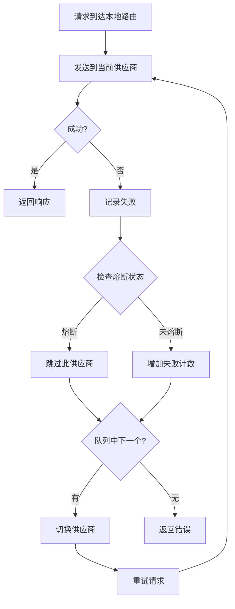
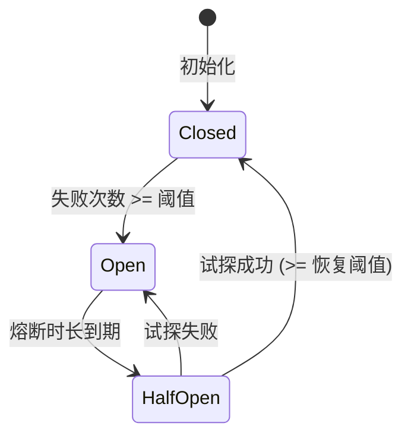

# 4.3 故障转移

## 功能说明

故障转移功能在主供应商请求失败时，自动切换到备用供应商，确保服务不中断。

**适用场景**：
- 供应商服务不稳定
- 需要高可用性
- 长时间运行的任务

## 前提条件

使用故障转移功能需要：

1. ✅ 应用已进入路由模式（应用页「路由」标签，点「开始路由」）
2. ✅ 在「路由」标签里打开故障转移开关
3. ✅ 队列里有供应商

故障转移只支持 Claude Code、Codex、Gemini CLI、Grok Build 四个应用；聚合模式不做故障转移（队列和设置会保留，回到路由模式后恢复）；累加式应用（OpenCode、OpenClaw、Hermes、Pi、MiniMax Code）没有故障转移队列。官方账号不进队列：它用客户端自己的登录，不能和别家轮换。

## 开启故障转移

### 操作步骤

1. 在应用页切到「路由」标签，确认该应用已处于路由模式
2. 打开标签栏右侧带「故障转移」提示的开关（图标是两条交叉的箭头）
3. 首次开启时会弹出确认框，点「我已了解，继续启用」

<!-- TODO(v4 截图): 应用页「路由」标签栏右侧的故障转移开关和「路由设置」按钮 -->

该开关只在应用已处于路由模式、并正在查看「路由」标签时出现。

### 开关说明

| 状态 | 行为 |
|------|------|
| 关闭 | 只路由到选定的一家供应商，不自动切换 |
| 开启 | 立即切换到队列 P1，并在请求失败时自动切换到队列中的下一个供应商；状态行显示「按队列」 |

## 管理故障转移队列

故障转移开启后，「路由」标签里的供应商分成两组：

- **队列 · 按优先级**：请求先发给第一位（P1），它连续失败时自动换到下一位
- **不在队列**：还没加入队列的供应商

### 添加备用供应商

在「不在队列」里，点供应商卡片上的「加入队列」。

### 调整优先级

用卡片上的上移、下移按钮，或直接拖动卡片调整顺序。序号越小优先级越高，队列顺序与首页供应商列表的顺序一致。

### 移除供应商

点队列里供应商卡片上的「移出队列」。

## 调整重试、超时和熔断参数

参数按应用分别设置，有两个入口：

- 应用页「路由」标签栏右侧的「路由设置」按钮：打开侧边面板，调当前应用的参数；面板底部的「更多路由设置」跳到设置页
- 「设置 → 本地路由 → 自动故障转移」：顶部选择应用，再调整该应用的参数

面板里分「重试与超时设置」和「熔断器设置」两部分，具体含义见下面各节。

## 故障转移流程

## 熔断器配置

熔断器防止频繁重试失败的供应商。

### 配置项

不同应用有独立的默认配置。以下为通用默认值，Claude 有独立的宽松配置。

| 配置 | 说明 | 通用默认值 | Claude 默认值 | 范围 |
|------|------|--------|--------|------|
| 失败阈值 | 连续失败多少次触发熔断 | 4 | 8 | 1-20 |
| 恢复成功阈值 | 半开状态下成功多少次后关闭熔断器 | 2 | 3 | 1-10 |
| 恢复等待时间 | 熔断后多久尝试恢复（秒） | 60 | 90 | 0-300 |
| 错误率阈值 | 错误率超过此值时打开熔断器 | 60% | 70% | 0-100% |
| 最小请求数 | 计算错误率前的最小请求数 | 10 | 15 | 5-100 |

> 💡 Claude 由于请求耗时较长，默认配置更为宽松，容忍更多失败次数。

### 超时配置

| 配置 | 说明 | 通用默认值 | Claude 默认值 | 范围 |
|------|------|--------|--------|------|
| 流式首字节超时 | 等待首个数据块的最大时间（秒） | 60 | 90 | 1-120 |
| 流式静默超时 | 数据块之间的最大间隔（秒） | 120 | 180 | 60-600（填 0 禁用） |
| 非流式超时 | 非流式请求的总超时时间（秒） | 600 | 600 | 60-1200 |

### 重试配置

| 配置 | 说明 | 通用默认值 | Claude 默认值 | 范围 |
|------|------|--------|--------|------|
| 最大重试次数 | 请求失败时的重试次数 | 3 | 6 | 0-10 |

> 💡 Gemini 的默认最大重试次数为 5。

### 熔断状态

| 状态 | 说明 |
|------|------|
| 关闭 | 正常状态，允许请求 |
| 开启 | 熔断状态，跳过此供应商 |
| 半开 | 尝试恢复，发送试探请求 |

### 状态转换

## 健康状态指示

### 供应商卡片

路由模式下，供应商卡片上显示健康状态徽章：

| 徽章 | 状态 | 说明 |
|------|------|------|
| 🟢 | 正常 | 连续失败次数为 0 |
| 🟡 | 降级 | 有失败但未触发熔断 |
| 🔴 | 熔断 | 已触发熔断，暂时跳过 |

### 队列

故障转移队列里的供应商卡片同样显示健康状态；「路由中」标记当前实际在用的那一家（故障转移成功后会换，不一定是队首）。

## 故障转移日志

每次故障转移会记录：

| 信息 | 说明 |
|------|------|
| 时间 | 发生时间 |
| 原供应商 | 失败的供应商 |
| 新供应商 | 切换到的供应商 |
| 失败原因 | 错误信息 |

在用量统计的请求日志中可以查看。

## 最佳实践

### 队列配置建议

1. **主供应商**：最稳定、最快的供应商
2. **第一备用**：次优选择
3. **第二备用**：保底选择

### 熔断器配置建议

| 场景 | 失败阈值 | 熔断时长 |
|------|----------|----------|
| 高可用要求 | 2 | 30 秒 |
| 一般场景 | 3 | 60 秒 |
| 容忍偶发失败 | 5 | 120 秒 |

### 监控建议

定期检查：
- 各供应商的健康状态
- 故障转移发生频率
- 熔断触发情况

## 常见问题

### 故障转移没有触发

检查：
1. 本地路由是否运行（设置 → 本地路由）
2. 应用是否处于路由模式（聚合模式不做故障转移）
3. 「路由」标签里的故障转移开关是否打开
4. 队列中是否有备用供应商

### 频繁触发故障转移

可能原因：
- 主供应商不稳定
- 网络问题
- 配置错误

解决方法：
- 检查主供应商状态
- 调整熔断器参数
- 考虑更换主供应商

### 所有供应商都熔断

等待熔断时长到期后自动恢复，或：
1. 在「设置 → 本地路由」先让应用回到直连，停止服务后重新开始路由
2. 或调整熔断器参数
