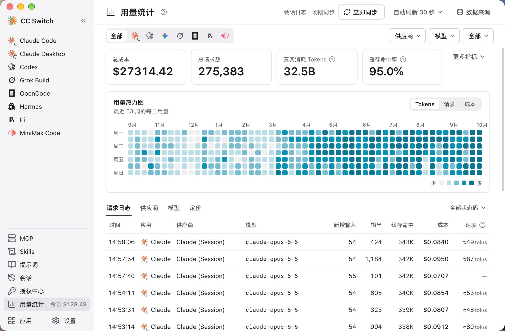

# 4.4 用量统计

## 功能说明

用量统计功能记录和分析 API 请求数据，帮助你：

- 了解 API 使用情况
- 估算费用支出
- 分析使用模式
- 排查问题

用量统计是侧栏里的全局页面。用量数据有两个来源：

| 数据来源                   | 覆盖范围                         | 是否需要本地路由 |
| -------------------------- | -------------------------------- | ---------------- |
| **路由请求日志**           | 经本地路由转发的所有请求         | 需要             |
| **CLI 会话日志**           | Claude Code、Codex、Gemini CLI、Grok Build、OpenCode、Pi、MiniMax Code 的本地会话记录 | 不需要           |

- 不开本地路由也能统计：CC Switch 默认会定期扫描各工具的本地会话记录，按供应商和模型统计请求数、Token、缓存命中率和花费
- **Codex 会话**：从 JSONL 会话日志**精确解析**，并对模型名称做归一化保证定价查询一致
- 用量页支持**按应用筛选**，数据互不干扰
- OpenClaw 和 Hermes 暂不支持用量统计；Claude Desktop 只统计经本地路由转发的「模型映射」请求，并计入 Claude Code 的筛选

## 前提条件

根据你使用的数据来源，前提条件不同：

**路由请求日志**（覆盖所有经本地路由转发的请求）：

1. ✅ 启动本地路由
2. ✅ 为对应应用开启路由
3. ✅ 开启「记录请求用量」（默认开启，在 设置 → 本地路由 里）

**CLI 会话日志**（无需本地路由）：

1. ✅ 确保对应 CLI 有会话历史文件
2. ✅ 保持「自动扫描会话日志」开启（默认开启）。关闭后，只在点「立即同步」时扫描
3. ✅ CC Switch 启动时扫描一次，之后每 60 秒扫描一次，并导入用量

> 会话日志里分不出具体是哪家供应商，这类记录的供应商列显示为「{应用} · 会话日志」。

## 打开用量统计

点击左侧栏的 **用量统计**。它是全局页面，不用先选应用，也不必开本地路由。

页面右上角有：

- **立即同步**：马上扫描一次会话日志（旁边显示上次同步时间）
- **自动刷新**：设置页面数据的自动刷新间隔，可关闭
- **数据来源**：打开侧边面板，管理会话日志扫描、「记录请求用量」，以及 Codex 用量维护（见下文）

## 统计概览

### 汇总卡片

页面顶部显示关键指标：

| 指标 | 说明 |
|------|------|
| 总成本 | 按定价配置估算的费用 |
| 总请求数 | 统计周期内的请求总数 |
| 真实消耗 Tokens | 新增输入 + 输出 + 缓存写入 + 缓存命中 |
| 缓存命中率 | 缓存命中 ÷（新增输入 + 缓存写入 + 缓存命中） |

点「更多指标」可以展开新增输入、输出、缓存写入、缓存命中的分项数字。部分协议（如 OpenAI）不上报缓存写入，缓存写入和真实消耗可能偏低。

切换时间范围、应用、供应商或模型筛选时，这些数字会一起更新，并与下方的日志和统计列表保持一致。

### 时间范围与筛选

| 时间范围 | 说明 |
|------|------|
| 当天 | 当天 00:00 至今 |
| 近 24 小时 / 近 7 天 / 近 14 天 / 近 30 天 | 过去对应时长 |
| 全部 | 全部历史 |
| 日历筛选 | 自定义开始和结束的日期与时间 |

筛选行可以：

- 按应用筛选：全部 / Claude Code / Codex / Gemini / OpenCode / Grok Build / Pi / MiniMax Code（Claude Desktop 经本地路由的请求计入 Claude Code）
- 按供应商和模型下拉筛选（模型列表随所选供应商联动）

OpenClaw 和 Hermes 暂不支持用量统计。

## 热力图与趋势图

### 用量热力图

显示最近 53 周每天的用量，颜色越深用量越大。

### 使用趋势

折线图展示随时间的变化，可在 **Tokens / 请求 / 成本** 三个指标之间切换：

- 过去 24 小时（以及当天）：按小时显示
- 7 天、30 天等更长范围：按天显示
- 悬停可查看该时间点的具体数字

> 💡 **缓存 Token 说明**：Anthropic API 支持 Prompt Caching。缓存创建时收取较高费用（通常为输入价格的 1.25 倍），但后续命中缓存时只收取 0.1 倍的价格，可大幅降低重复请求的成本。

## 详细数据

页面下方有四个 Tab：**请求日志**、**供应商**、**模型**、**定价**（定价见下一节）。

### 请求日志

每条请求的记录：

| 字段 | 说明 |
|------|------|
| 时间 | 请求时间 |
| 应用 | 所属应用 |
| 供应商 | 使用的供应商名称（会话日志导入的显示为「{应用} · 会话日志」） |
| 模型 | 请求的模型 |
| 新增输入 | 不含缓存的输入 Token 数 |
| 输出 | 输出 Token 数 |
| 缓存命中 | 缓存命中的 Token 数 |
| 成本 | 估算费用（美元）；没有定价的模型显示「未定价」 |
| 速度 | 每秒输出多少 token（见下文） |

悬停可以看到耗时、首字时间、缓存写入等细节；点击请求行打开详情面板，可以看到来源（路由服务及状态码，或会话日志）、Tokens 用量、成本明细和性能信息。表格右上角的状态码筛选可以只看某一类状态码的请求。

#### 速度怎么算

速度是每秒输出的 token 数，从首字算到结束。只统计经本地路由、输出不少于 100 token 的请求；思考过程不外露的模型是近似值。

没开路由时，速度按会话日志的时间戳估算，显示为「≈ xx tok/s」：没有首字计时，等首字的时间也算在内，所以偏低，且只估输出不少于 200 token 的请求。

### 供应商

按供应商分组的统计：请求数、Tokens、成本、成功率、速度。

### 模型

按模型分组的统计：请求数、Tokens、成本、平均成本、成功率、速度。

## 数据来源面板

点页面右上角的「数据来源」打开：

- **自动扫描会话日志**：开关，并可「立即同步」。面板里列出覆盖的应用，以及「Hermes、OpenClaw 暂不支持用量统计」
- **记录请求用量**：显示是否开启，点「修改」跳到 设置 → 本地路由 调整
- **Codex 用量维护**：「重建 Codex 用量」会清除现有 Codex 会话明细与汇总，再从本地 Codex 日志重新导入。重建前会自动备份数据库；已被删除的日志对应的历史无法重新导入

## 定价配置

### 打开定价配置

用量统计页 → **定价** Tab

页面上方的「计费默认配置」决定各应用按「请求模型」还是「返回模型」匹配定价，点「修改」调整，只对经本地路由的请求生效；会话日志导入的用量按日志里的模型计价。

下方是「模型定价」表。除了手动填写，也可以在「新增定价」/「编辑定价」对话框里点击「从 models.dev 导入」，导入公开的模型定价。

### 配置模型价格

为每个模型设置价格（每百万 Token）：

| 字段 | 说明 |
|------|------|
| 模型 ID | 模型标识符（如 claude-3-sonnet） |
| 显示名称 | 自定义显示名称 |
| 输入价格 | 每百万输入 Token 的价格 |
| 输出价格 | 每百万输出 Token 的价格 |
| 缓存读取价格 | 每百万缓存命中 Token 的价格 |
| 缓存创建价格 | 每百万缓存创建 Token 的价格 |

### 模型 ID 匹配规则

在匹配定价前，CC Switch 会先对请求中的模型 ID 做标准化处理：

- 去掉最后一个 `/` 之前的前缀，并转成小写
- 去掉 `:` 之后的后缀，去掉末尾的 `[1m]`
- 将 `@` 替换为 `-`
- 去掉常见包装前缀、版本后缀、日期后缀（`-YYYY-MM-DD`、`-YYYYMMDD`）
- 部分模型族支持短 ID 匹配带版本的定价项

因此，在定价配置中请填写清洗后的模型 ID，而不是请求里的完整原始模型名。

| 原始模型名 | 应填写的模型 ID | 说明 |
|------|------|------|
| `stepfun-ai/step-3.5-flash` | `step-3.5-flash` | 去掉供应商前缀 |
| `moonshotai/kimi-k2-0905:exa` | `kimi-k2-0905` | 去掉前缀和 `:` 后缀 |
| `gpt-5.2-codex@low` | `gpt-5.2-codex-low` | 将 `@` 替换为 `-` |
| `OpenAI/GPT-5.5-2026-05-14` | `gpt-5.5` | 去掉前缀和日期后缀 |
| `anthropic/claude-opus-4.8` | `claude-opus-4-8` | 去掉前缀并匹配点号格式 |
| `global.anthropic.claude-opus-4-8-v1:0` | `claude-opus-4-8` | 去掉包装前缀、版本后缀和 `:` 后缀 |
| `claude-haiku-4-5` | `claude-haiku-4-5-20251001` | 短 ID 匹配带版本定价 |

### 操作

- **添加**：点击「新增」按钮新增模型定价
- **编辑**：点击行末的编辑图标修改
- **删除**：点击行末的删除图标移除

定价 Tab 里还有「自动同步 models.dev 定价」：开启后，CC Switch 会在启动时（最多每 6 小时一次）从 models.dev 更新你选的模型价格，同一模型 ID 的内置价格和手动设置价格都会被覆盖，因此开启前会弹出确认。可以「选择模型」，也可以让它自动包含常用模型。

<!-- TODO(v4 截图): 用量统计页「定价」Tab（计费默认配置 + 模型定价表） -->

### 预设价格

CC Switch 预设了常用模型的官方价格（每百万 Token）。v3.13.0 修正了部分模型的 **CNY → USD 定价**并补齐了此前缺失的模型定义，同时修复了 **MiniMax 套餐配额数学**与 **0% → 100% 用量进度**，使费用估算和套餐进度展示更准确。

**Claude 系列（美元）**：

| 模型 | 输入 | 输出 | 缓存读取 | 缓存创建 |
|------|------|------|----------|----------|
| **Claude 4.8 系列** | | | | |
| claude-opus-4-8 | $5 | $25 | $0.50 | $6.25 |
| **Claude 4.5 系列** | | | | |
| claude-opus-4-5 | $5 | $25 | $0.50 | $6.25 |
| claude-sonnet-4-5 | $3 | $15 | $0.30 | $3.75 |
| claude-haiku-4-5 | $1 | $5 | $0.10 | $1.25 |
| **Claude 4 系列** | | | | |
| claude-opus-4 | $15 | $75 | $1.50 | $18.75 |
| claude-opus-4-1 | $15 | $75 | $1.50 | $18.75 |
| claude-sonnet-4 | $3 | $15 | $0.30 | $3.75 |
| **Claude 3.5 系列** | | | | |
| claude-3-5-sonnet | $3 | $15 | $0.30 | $3.75 |
| claude-3-5-haiku | $0.80 | $4 | $0.08 | $1.00 |

**OpenAI 系列 / Codex（美元）**：

| 模型 | 输入 | 输出 | 缓存读取 |
|------|------|------|----------|
| **GPT-5.2 系列** | | | |
| gpt-5.2 | $1.75 | $14 | $0.175 |
| **GPT-5.1 系列** | | | |
| gpt-5.1 | $1.25 | $10 | $0.125 |
| **GPT-5 系列** | | | |
| gpt-5 | $1.25 | $10 | $0.125 |

> 注：Codex 预设包含了 low/medium/high 等变体，价格与基础模型一致。

**Gemini 系列（美元）**：

| 模型 | 输入 | 输出 | 缓存读取 |
|------|------|------|----------|
| **Gemini 3 系列** | | | |
| gemini-3-pro-preview | $2 | $12 | $0.20 |
| gemini-3-flash-preview | $0.50 | $3 | $0.05 |
| **Gemini 2.5 系列** | | | |
| gemini-2.5-pro | $1.25 | $10 | $0.125 |
| gemini-2.5-flash | $0.30 | $2.50 | $0.03 |

**中国厂商模型**：

> 注：币种遵循各供应商官方定价页面。StepFun 当前按美元列出。
>
> **DeepSeek 兼容**：旧模型名 `deepseek-chat` / `deepseek-reasoner` 现等价于 `deepseek-v4-flash`（非思考/思考模式），按 v4-flash 价格计费。

| 模型 | 输入 | 输出 | 缓存读取 |
|------|------|------|----------|
| **StepFun** | | | |
| step-3.5-flash | $0.10 | $0.30 | $0.02 |
| **DeepSeek** | | | |
| deepseek-v4-flash | ¥1.00 | ¥2.00 | ¥0.20 |
| deepseek-v4-pro | ¥12.00 | ¥24.00 | ¥1.00 |
| **Kimi (月之暗面)** | | | |
| kimi-k2-thinking | ¥4.00 | ¥16.00 | ¥1.00 |
| kimi-k2 | ¥4.00 | ¥16.00 | ¥1.00 |
| kimi-k2-turbo | ¥8.00 | ¥58.00 | ¥1.00 |
| **MiniMax** | | | |
| minimax-m2.1 | ¥2.10 | ¥8.40 | ¥0.21 |
| minimax-m2.1-lightning | ¥2.10 | ¥16.80 | ¥0.21 |
| **其他** | | | |
| glm-4.7 | ¥2.00 | ¥8.00 | ¥0.40 |
| doubao-seed-code | ¥1.20 | ¥8.00 | ¥0.24 |
| mimo-v2-flash | 免费 | 免费 | - |

### 自定义价格

如果使用中转服务，价格可能不同：

1. 点击「编辑」按钮
2. 修改价格
3. 保存

## 常见问题

### 统计数据为空

检查：
- 「自动扫描会话日志」是否开启，对应 CLI 是否有会话历史（不开本地路由时的数据来源）
- 如果依赖路由请求日志：本地路由是否运行、对应应用的路由是否开启、「记录请求用量」是否开启
- 该应用是否支持用量统计（OpenClaw、Hermes 暂不支持）

### 费用估算不准确

可能原因：
- 定价配置与实际不符
- 使用了中转服务的特殊定价

解决方法：
- 更新定价配置
- 参考供应商的实际账单

### Token 数量与供应商不一致

CC Switch 使用自己的方式估算 Token 数，可能与供应商的计算方式略有差异。以供应商账单为准。
